# HTTP Tunnel

> 🌐 **[English](#english) | [中文文档](./README_CN.md)**

A serverless HTTP tunnel built with Rust and AWS Lambda, providing secure access to local development servers through public URLs - similar to ngrok, but fully serverless and self-hosted.

## English

### Overview

HTTP Tunnel allows you to expose local services (like `localhost:3000`) to the internet through a public URL. Perfect for:

- Testing webhooks during local development (Stripe, GitHub, Twilio, etc.)
- Sharing work-in-progress with clients or teammates
- Testing mobile apps against local backends
- Demoing features without deploying
- API development with external services requiring public URLs
- IoT development with callback testing

**Architecture**: Fully serverless (AWS Lambda + API Gateway + DynamoDB) for cost-effective, auto-scaling infrastructure with zero operational overhead.

### Features

- **Serverless Architecture**: Zero operational overhead, pay only for actual usage
- **Secure WebSocket Tunneling**: Encrypted persistent connections (WSS/HTTPS)
- **Automatic Reconnection**: Exponential backoff strategy handles network interruptions gracefully
- **JWT/JWKS Authentication**: Optional token-based authentication with RSA/HMAC support
- **Custom Domains**: Support for custom domain names with ACM certificates
- **Fast & Efficient**: Low-latency request forwarding powered by Rust performance
- **Event-Driven**: Optional DynamoDB Streams + EventBridge for optimized response delivery
- **Load Testing Ready**: Handles concurrent requests with proper timeout handling
- **Multiple HTTP Methods**: Full support for GET, POST, PUT, DELETE, PATCH, HEAD, OPTIONS
- **Binary Data Support**: Base64 encoding for binary request/response bodies
- **Open Source**: MIT licensed, fully customizable and auditable

## Quick Start

### Prerequisites

- Rust 1.70+ with cargo
- AWS account with configured credentials
- Node.js 18+ (for infrastructure deployment)
- Pulumi CLI (for infrastructure management)

### Installation

#### Option 1: Build from source

```bash
# Clone the repository
git clone https://github.com/tyrchen/http-tunnel.git
cd http-tunnel

# Build the forwarder agent
cargo build --release --bin ttf

# The binary will be at target/release/ttf
```

#### Option 2: Install via cargo

```bash
cargo install --git https://github.com/tyrchen/http-tunnel --bin ttf
```

### Deploy Infrastructure

```bash
# Deploy AWS infrastructure (Lambda, API Gateway, DynamoDB)
make deploy-infra

# Note the WebSocket endpoint from the output
```

### Start Forwarding

```bash
# Forward local service to the internet (uses default endpoint and port 3000)
ttf

# Or specify custom endpoint and port
ttf --endpoint wss://YOUR_WEBSOCKET_ENDPOINT --local-port 8080

# You'll receive a public URL like: https://abc123.execute-api.us-west-2.amazonaws.com
```

Now any HTTP request to your public URL will be forwarded to your local service.

**Default Configuration**:

- Endpoint: `wss://ws.example.com/dev`
- Local port: `3000`
- Local host: `127.0.0.1`

## Architecture

### System Overview


**Components**:

- **Local Forwarder** (`ttf`): Rust CLI agent running on your machine
- **Lambda Handler**: Unified serverless function handling multiple event types (WebSocket and HTTP)
- **API Gateway**: WebSocket API for agent connections, HTTP API for public requests
- **DynamoDB**: Tracks connections and pending requests with GSI for efficient lookups
- **EventBridge**: Optional event-driven architecture for optimized response delivery

### Request/Response Flow


### Connection Lifecycle

```mermaid
sequenceDiagram
    participant Agent as Forwarder Agent
    participant WSAPI as WebSocket API
    participant ConnHandler as Connect Handler
    participant DynamoDB as DynamoDB

    Note over Agent: Start ttf CLI<br/>--endpoint wss://...

    Agent->>WSAPI: WebSocket Upgrade Request

    WSAPI->>ConnHandler: $connect route event

    Note over ConnHandler: Authenticate (if enabled)<br/>Generate tunnel_id (12 chars)

    ConnHandler->>DynamoDB: PutItem to Connections Table<br/>(connectionId, tunnelId, URLs, TTL=2hrs)

    ConnHandler-->>WSAPI: 200 OK
    WSAPI-->>Agent: WebSocket Connection Established

    Agent->>WSAPI: Send Ready Message
    WSAPI->>ConnHandler: $default route (Ready)

    Note over ConnHandler: Response Handler receives Ready

    ConnHandler->>DynamoDB: GetItem (lookup connection metadata)

    loop Retry with exponential backoff
        ConnHandler->>WSAPI: PostToConnection<br/>(ConnectionEstablished)
        WSAPI->>Agent: WebSocket message with tunnel info
    end

    Note over Agent: Display public URLs<br/>Start heartbeat (5 min interval)

    loop Active Connection
        Agent->>WSAPI: Ping message (every 5 min)
        WSAPI-->>Agent: Pong response
    end

    Note over WSAPI: Connection lost or closed

    WSAPI->>ConnHandler: $disconnect event
    Note over ConnHandler: Disconnect Handler cleanup

    ConnHandler->>DynamoDB: Delete connection metadata

    Note over Agent: Auto-reconnect with<br/>exponential backoff (1s→2s→4s...max 60s)
```



### Error Handling Flow


For detailed architecture specifications, see [specs/0001-idea.md](specs/0001-idea.md).

## Usage

### Basic Usage

```bash
# Forward localhost:3000 to the internet (uses default endpoint)
ttf

# Or specify custom endpoint
ttf --endpoint wss://YOUR_ENDPOINT
```

### With Custom Port

```bash
# Forward a different local port
ttf --port 8080

# Or use short form
ttf -p 8080
```

### With Custom Domain

```bash
# Use your own domain (requires custom domain setup)
ttf --endpoint wss://ws.yourdomain.com
```

### Environment Variables

```bash
# Override default endpoint via environment variable
export TUNNEL_ENDPOINT=wss://YOUR_CUSTOM_ENDPOINT

# Set authentication token
export TUNNEL_TOKEN=your_jwt_token

# Run with environment configuration
ttf
```

## Project Structure

```
http-tunnel/
├── apps/
│   ├── forwarder/          # Local agent CLI (ttf binary)
│   └── handler/            # AWS Lambda function
├── crates/
│   └── common/             # Shared library (protocol, models, utilities)
├── infra/                  # Pulumi infrastructure as code
│   ├── src/                # TypeScript infrastructure modules
│   ├── scripts/            # Deployment helper scripts
│   └── README.md           # Infrastructure documentation
├── testapp/                # Example TodoMVC API server for testing
│   ├── main.py             # FastAPI application
│   └── pyproject.toml      # Python dependencies
└── specs/                  # Architecture and implementation specs
    ├── 0001-idea.md        # Architecture design
    ├── 0002-common.md      # Common library spec
    ├── 0003-forwarder.md   # Forwarder agent spec
    ├── 0004-lambda.md      # Lambda functions spec
    ├── 0005-iac.md         # Infrastructure spec
    └── 0006-implementation-plan.md
```

## Development

### Build Commands

```bash
# Build all components
cargo build

# Build forwarder agent only
cargo build --bin ttf

# Build Lambda handler (requires cargo-lambda)
cargo lambda build --release --arm64 --bin handler

# Run tests
cargo test

# Run linter
cargo clippy
```

### Test Application

A sample TodoMVC API server is included in `testapp/` for testing the HTTP tunnel:

```bash
# Run the test app on port 3000
make run-testapp

# The API will be available at http://localhost:3000
# Interactive docs at http://localhost:3000/docs
```

**Test App Features**:

- In-memory CRUD API for todo items
- Pre-loaded with meaningful dummy data
- RESTful endpoints: GET, POST, PUT, DELETE
- Perfect for testing the tunnel forwarding functionality

**Example Usage**:

```bash
# In terminal 1: Start the test app
make run-testapp

# In terminal 2: Start the tunnel forwarder (uses default endpoint and port 3000)
ttf

# In terminal 3: Access your local app via the public tunnel URL
curl https://YOUR_TUNNEL_URL/todos
```

### Infrastructure Commands

```bash
# Preview infrastructure changes
make preview-infra

# Deploy infrastructure
make deploy-infra

# Destroy infrastructure
make destroy-infra
```

### Custom Domain Setup

To use your own domain instead of API Gateway URLs:

1. Configure your domain in `infra/Pulumi.dev.yaml`
2. Set up ACM certificate (see [infra/QUICKSTART_CUSTOM_DOMAIN.md](infra/QUICKSTART_CUSTOM_DOMAIN.md))
3. Deploy infrastructure
4. Configure DNS records

See [infra/README.md](infra/README.md) for detailed instructions.

## How It Works

1. **Agent Connection**: The `ttf` CLI connects to AWS API Gateway WebSocket endpoint
2. **Registration**: Lambda assigns a unique subdomain/connection ID
3. **HTTP Request**: User makes HTTP request to the public URL
4. **Forwarding**: Lambda looks up the connection and forwards request via WebSocket
5. **Local Processing**: Agent receives request and forwards to local service
6. **Response**: Agent sends response back through WebSocket
7. **Completion**: Lambda receives response and returns to original HTTP caller

## Configuration

### Forwarder Configuration

```bash
ttf --help

Options:
  -e, --endpoint <URL>       WebSocket endpoint URL [default: wss://ws.example.com/dev]
  -p, --port <PORT>          Local service port to forward to [default: 3000]
  --host <HOST>              Local service host [default: 127.0.0.1]
  -t, --token <TOKEN>        Authentication token (JWT)
  -v, --verbose              Enable verbose logging
  --connect-timeout <SECS>   Connection timeout in seconds [default: 10]
  --request-timeout <SECS>   Request timeout in seconds [default: 25]
```

**Environment Variables**:

- `TUNNEL_ENDPOINT`: Override default WebSocket endpoint
- `TUNNEL_TOKEN`: Set authentication token

### Infrastructure Configuration

Edit `infra/Pulumi.dev.yaml`:

```yaml
config:
  aws:region: us-west-2
  aws:profile: your-aws-profile
  http-tunnel:environment: dev
  http-tunnel:lambdaArchitecture: arm64
  http-tunnel:lambdaMemorySize: "256"
  http-tunnel:lambdaTimeout: "30"
  http-tunnel:enableCustomDomain: "false"
```

See [infra/README.md](infra/README.md) for all configuration options.

## Cost Estimation

Approximate monthly costs (us-west-2 region):

| Service               | Usage                         | Cost            |
| --------------------- | ----------------------------- | --------------- |
| Lambda                | 1M requests, 256MB, 500ms avg | ~$3.00          |
| API Gateway WebSocket | 1M messages                   | ~$1.00          |
| API Gateway HTTP      | 1M requests                   | ~$1.00          |
| DynamoDB              | 1M reads, 100K writes         | ~$0.50          |
| Custom Domains        | 2 domains (optional)          | ~$2.00          |
| **Total**             |                               | **~$5.50-7.50** |

AWS Free Tier may significantly reduce costs for development/testing usage.

## Monitoring

The deployed infrastructure includes CloudWatch logs for:

- WebSocket connection events
- HTTP request forwarding
- Lambda function execution
- Error tracking

Access logs via AWS Console or CLI:

```bash
# View Lambda logs
aws logs tail /aws/lambda/http-tunnel-handler-dev --follow

# View API Gateway logs
aws logs tail /aws/apigateway/http-tunnel-dev --follow
```

## Troubleshooting

### Connection Issues

**Problem**: Agent can't connect to WebSocket endpoint

**Solution**:

1. Verify endpoint URL is correct (should start with `wss://`)
2. Check AWS credentials are configured
3. Ensure infrastructure is deployed (`make deploy-infra`)
4. Check CloudWatch logs for errors

### Request Timeout

**Problem**: HTTP requests timeout waiting for response

**Solution**:

1. Ensure local service is running on specified port
2. Check agent is connected (should show "Connected" in logs)
3. Verify no firewall blocking local connections
4. Check Lambda timeout settings (increase if needed)

### Custom Domain Not Working

**Problem**: Custom domain not resolving or returns errors

**Solution**:

1. Verify ACM certificate is in "ISSUED" status
2. Check DNS records are correctly configured
3. Wait 5-10 minutes for DNS propagation
4. See [infra/CUSTOM_DOMAIN_SETUP.md](infra/CUSTOM_DOMAIN_SETUP.md) for detailed troubleshooting

## Documentation

- **[specs/README.md](specs/README.md)**: Complete technical specifications
- **[specs/0001-idea.md](specs/0001-idea.md)**: Architecture design document
- **[infra/README.md](infra/README.md)**: Infrastructure deployment guide
- **[infra/QUICKSTART_CUSTOM_DOMAIN.md](infra/QUICKSTART_CUSTOM_DOMAIN.md)**: Custom domain quick setup
- **[infra/CUSTOM_DOMAIN_SETUP.md](infra/CUSTOM_DOMAIN_SETUP.md)**: Complete custom domain reference

## Contributing

Contributions are welcome! Please:

1. Fork the repository
2. Create a feature branch
3. Make your changes
4. Add tests for new functionality
5. Ensure all tests pass (`cargo test`)
6. Run linter (`cargo clippy`)
7. Submit a pull request

## Comparison with ngrok

| Feature              | HTTP Tunnel         | ngrok                 |
| -------------------- | ------------------- | --------------------- |
| **Deployment**       | Self-hosted (AWS)   | SaaS                  |
| **Cost**             | Pay AWS costs (~$5) | Free/$10-$35/month    |
| **Custom Domain**    | ✅ Included         | ✅ (paid plans)       |
| **Open Source**      | ✅ MIT License      | ❌ Proprietary        |
| **Data Privacy**     | Your AWS account    | ngrok servers         |
| **Scaling**          | Auto (serverless)   | Managed by ngrok      |
| **Setup Complexity** | Medium (AWS + Rust) | Easy (download & run) |

## Security

- **End-to-end TLS**: All communication encrypted (HTTPS + WSS)
- **Isolated Connections**: Each connection has unique credentials
- **No Persistent Storage**: Request/response data not stored
- **IAM Policies**: Least-privilege access for Lambda functions
- **TTL Cleanup**: Automatic cleanup of stale data

For production use, consider:

- Implementing authentication on the WebSocket connection
- Adding request filtering/validation
- Setting up AWS WAF rules
- Enabling VPC endpoints for Lambda-DynamoDB communication

## License

This project is distributed under the terms of MIT.

See [LICENSE](LICENSE.md) for details.

Copyright 2025 Tyr Chen

## Acknowledgments

Inspired by [ngrok](https://ngrok.com/) and built with:

- [Rust](https://www.rust-lang.org/) - Systems programming language
- [Tokio](https://tokio.rs/) - Async runtime
- [AWS Lambda](https://aws.amazon.com/lambda/) - Serverless compute
- [Pulumi](https://www.pulumi.com/) - Infrastructure as code
