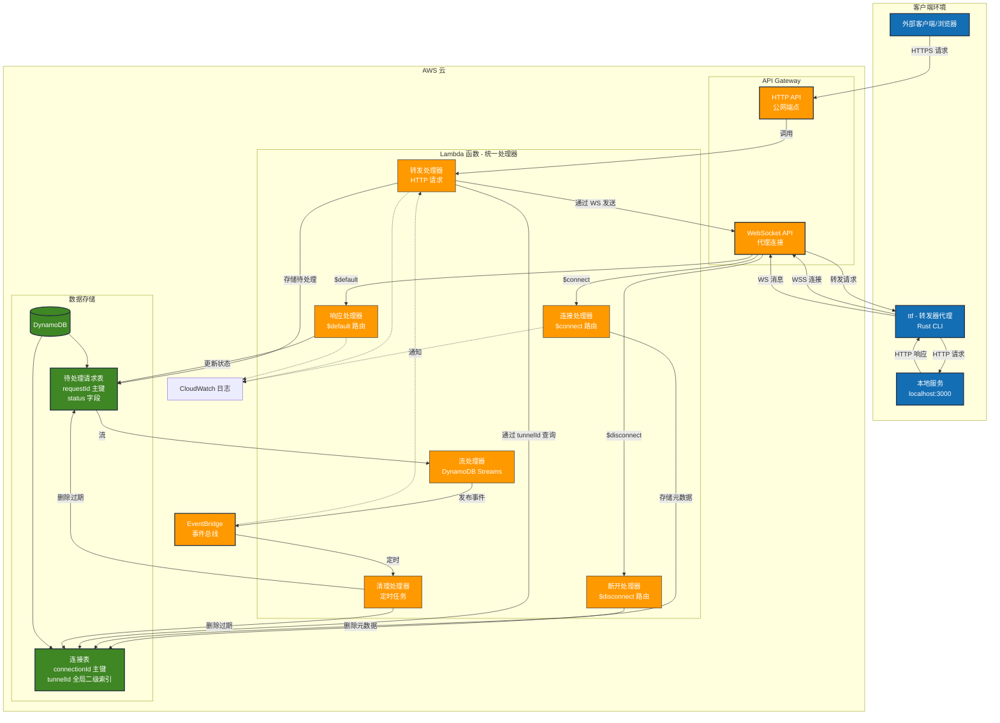
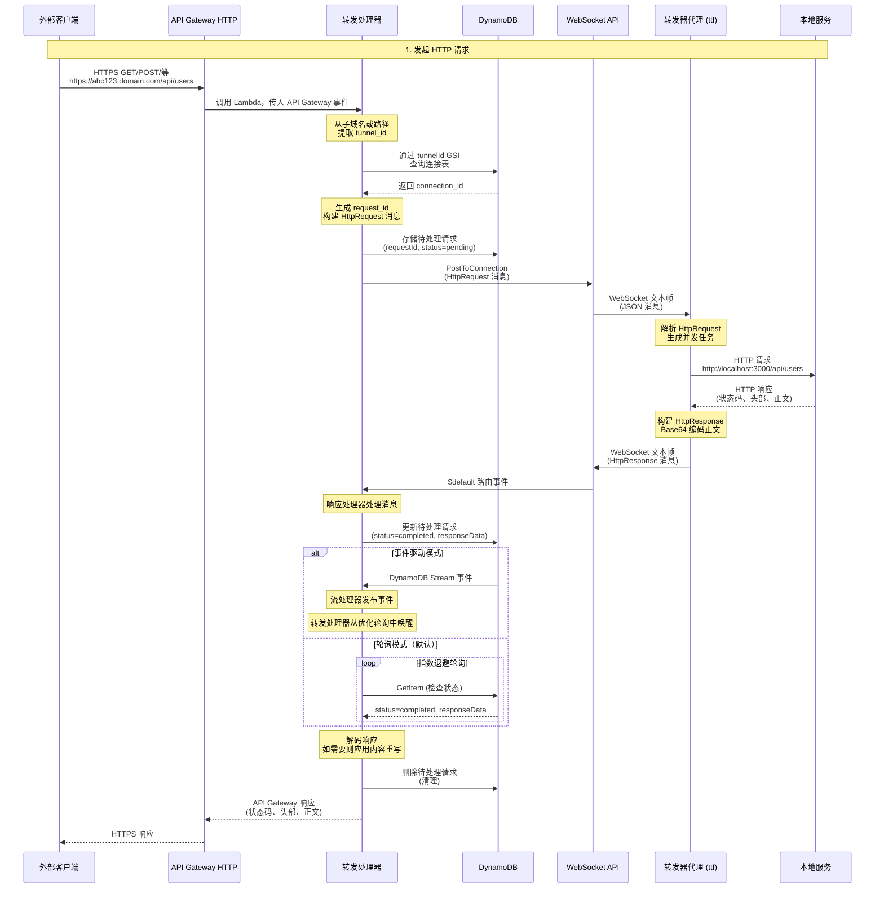
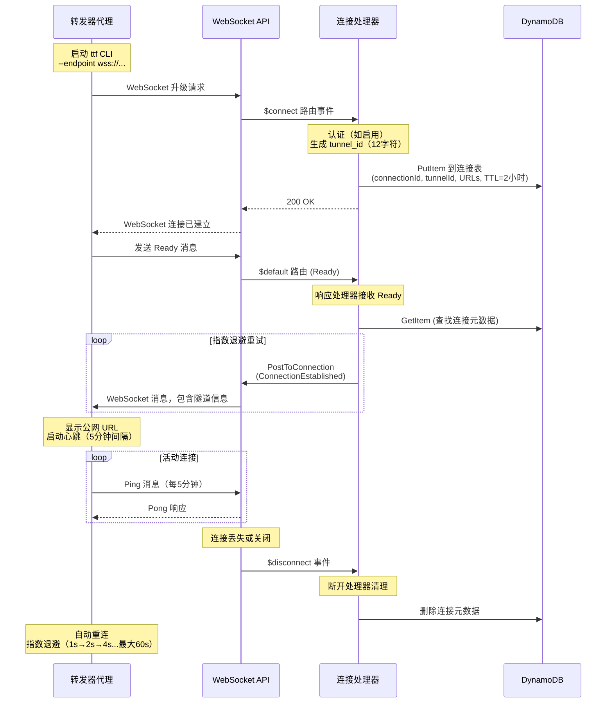
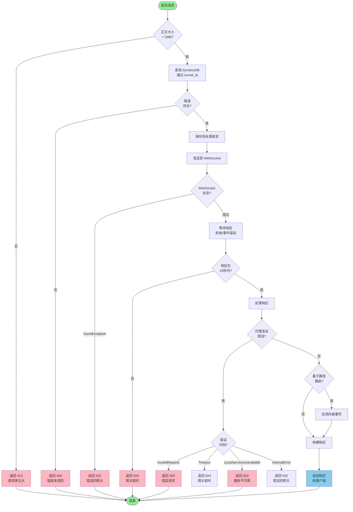

# HTTP Tunnel

> 🌐 **[English](./README.md) | [中文](#中文文档)**

基于 Rust 和 AWS Lambda 构建的无服务器 HTTP 隧道，通过公网 URL 安全访问本地开发服务器 - 类似 ngrok，但完全无服务器且可自托管。

## 中文文档

### 概述

HTTP Tunnel 允许你将本地服务（如 `localhost:3000`）通过公网 URL 暴露到互联网。非常适合:

- 在本地开发期间测试 webhook（Stripe、GitHub、Twilio 等）
- 与客户或团队成员分享进行中的工作
- 针对本地后端测试移动应用
- 无需部署即可演示功能
- 需要公网 URL 的外部服务 API 开发
- 带回调测试的物联网开发

**架构**: 完全无服务器（AWS Lambda + API Gateway + DynamoDB），零运维开销的成本友好型自动扩展基础设施。

### 特性

- **无服务器架构**: 零运维开销，按实际使用量付费
- **安全 WebSocket 隧道**: 加密持久连接（WSS/HTTPS）
- **自动重连**: 指数退避策略优雅处理网络中断
- **JWT/JWKS 认证**: 支持 RSA/HMAC 的可选基于令牌的认证
- **自定义域名**: 支持使用 ACM 证书的自定义域名
- **快速高效**: Rust 性能驱动的低延迟请求转发
- **事件驱动**: 可选的 DynamoDB Streams + EventBridge 优化响应传递
- **支持负载测试**: 正确的超时处理支持并发请求
- **多种 HTTP 方法**: 完整支持 GET, POST, PUT, DELETE, PATCH, HEAD, OPTIONS
- **二进制数据支持**: 请求/响应体的 Base64 编码
- **开源**: MIT 许可，完全可定制和可审计

### 架构

#### 系统概览



**组件说明**:

- **本地转发器** (`ttf`): 运行在开发机器上的 Rust CLI 代理
- **Lambda 处理器**: 统一的无服务器函数，处理多种事件类型（WebSocket 和 HTTP）
- **API Gateway**: WebSocket API 用于代理连接，HTTP API 用于公网请求
- **DynamoDB**: 使用全局二级索引追踪连接和待处理请求，实现高效查询
- **EventBridge**: 可选的事件驱动架构，用于优化响应传递

#### 请求/响应流程



#### 连接生命周期



#### 错误处理流程



**数据流说明**:

1. **连接**: 客户端建立 WebSocket，接收唯一隧道 ID
2. **HTTP 请求**: 公网请求访问 HTTP API，从子域名或路径提取隧道 ID
3. **转发**: Lambda 查找连接，通过 WebSocket 发送请求
4. **处理**: 客户端转发到本地服务，获取响应
5. **返回**: 客户端通过 WebSocket 发送响应，Lambda 返回给调用者

详细架构文档请参见 [specs/0001-idea.md](./specs/0001-idea.md)。

### 快速开始

#### 前置要求

- **Rust** 1.70+ 及 cargo
- **AWS 账号** 及配置的凭证
- **Node.js** 18+ 用于基础设施部署
- **Pulumi CLI** 用于基础设施管理
- **cargo-lambda** 用于构建 Lambda 函数

```bash
# 安装 cargo-lambda
cargo install cargo-lambda

# 安装 Pulumi
curl -fsSL https://get.pulumi.com | sh
```

#### 安装

**方式 1: 从源码构建**

```bash
# 克隆仓库
git clone https://github.com/tyrchen/http-tunnel.git
cd http-tunnel

# 构建转发器代理
cargo build --release --bin ttf

# 二进制文件位于 target/release/ttf
```

**方式 2: 通过 cargo 安装**

```bash
cargo install --git https://github.com/tyrchen/http-tunnel --bin ttf
```

#### 部署基础设施

详细说明请参见 [基础设施部署指南](./infra/README.md)。

快速部署:

```bash
# 配置 AWS 凭证
export AWS_PROFILE=your-profile
export AWS_REGION=us-east-1

# 构建 Lambda 函数
make build-lambda

# 部署基础设施
cd infra
npm install
pulumi stack init dev
pulumi up

# 从输出获取 WebSocket 端点
pulumi stack output websocketApiEndpoint
```

#### 使用方法

**启动隧道转发器:**

```bash
# 转发本地端口 3000（默认）
ttf --endpoint wss://your-websocket-api.execute-api.us-east-1.amazonaws.com/dev

# 转发自定义端口
ttf --endpoint wss://your-api.com/dev --port 8080

# 使用认证
ttf --endpoint wss://your-api.com/dev --token your-jwt-token

# 启用详细日志
ttf --endpoint wss://your-api.com/dev --verbose
```

**访问本地服务:**

隧道连接后，你会看到:

```
HTTP Tunnel Forwarder v0.1.0
Local service: 127.0.0.1:3000
Tunnel endpoint: wss://your-api.com/dev
✅ WebSocket connection established
Tunnel established: https://abc123xyz456.execute-api.us-east-1.amazonaws.com
```

现在任何对公网 URL 的请求都将转发到你的本地服务。

### 命令行选项

```
ttf [OPTIONS]

选项:
  -e, --endpoint <URL>           WebSocket 端点 URL
                                 [环境变量: TTF_ENDPOINT]
                                 [默认: wss://your-websocket-api...]

  -p, --port <PORT>              本地服务端口
                                 [默认: 3000]

      --host <HOST>              本地服务主机地址
                                 [默认: 127.0.0.1]

  -t, --token <TOKEN>            JWT 认证令牌（可选）
                                 [环境变量: TTF_TOKEN]

  -v, --verbose                  启用详细日志

      --connect-timeout <SECS>   连接超时秒数
                                 [默认: 10]

      --request-timeout <SECS>   调用本地服务的请求超时秒数
                                 [默认: 25]

  -h, --help                     打印帮助信息
  -V, --version                  打印版本信息
```

### 配置

#### 环境变量

```bash
# 通过环境变量覆盖默认端点
export TTF_ENDPOINT=wss://your-websocket-api.execute-api.us-east-1.amazonaws.com/dev

# 设置认证令牌
export TTF_TOKEN=your_jwt_token

# 使用环境配置运行
ttf
```

#### 使用 .env 文件

```bash
# 创建 .env 文件
cat > .env << 'ENVEOF'
TTF_ENDPOINT=wss://your-api.execute-api.us-east-1.amazonaws.com/dev
TTF_TOKEN=your-jwt-token-here
ENVEOF

# 加载并运行
source .env
ttf
```

### 认证

HTTP Tunnel 支持 JWT 认证，包括 RSA (RS256/RS384/RS512) 和 HMAC (HS256/HS384/HS512) 算法。

**生成 JWT 令牌（示例）:**

```bash
# 使用 JWT 工具或库
# 令牌应包含:
# - sub: 用户/客户端标识符
# - exp: 过期时间戳
# - iat: 签发时间戳（可选）

# Python 示例:
python3 -c "
import jwt
import time

payload = {
    'sub': 'user123',
    'exp': int(time.time()) + 3600,  # 1 小时
    'iat': int(time.time())
}

token = jwt.encode(payload, 'your-secret-key', algorithm='HS256')
print(token)
"
```

**配置服务端认证:**

在 Lambda 函数中设置环境变量:

- `REQUIRE_AUTH=true`: 启用认证
- `JWKS`: RSA 验证的 JSON Web Key Set
- `JWT_SECRET`: HMAC 验证的对称密钥

配置详情请参见 [基础设施部署指南](./infra/README.md)。

### 项目结构

```
http-tunnel/
├── apps/
│   ├── forwarder/          # 本地客户端代理（ttf 二进制）
│   └── handler/            # AWS Lambda 函数
├── crates/
│   └── common/             # 共享库（协议、模型、工具）
├── infra/                  # Pulumi 基础设施即代码
│   ├── src/                # TypeScript 基础设施模块
│   ├── scripts/            # 部署辅助脚本
│   └── README.md           # 基础设施文档
├── testapp/                # TodoMVC API 示例服务器用于测试
│   ├── main.py             # FastAPI 应用
│   └── pyproject.toml      # Python 依赖
└── specs/                  # 架构和实现规范
    ├── 0001-idea.md        # 架构设计
    ├── 0002-common.md      # 通用库规范
    ├── 0003-forwarder.md   # 转发器代理规范
    ├── 0004-lambda.md      # Lambda 函数规范
    └── 0005-iac.md         # 基础设施规范
```

### 开发

#### 构建命令

```bash
# 构建所有组件
cargo build

# 仅构建转发器代理
cargo build --bin ttf

# 构建 Lambda 处理器（需要 cargo-lambda）
cargo lambda build --release --arm64 --bin handler

# 运行测试
cargo test

# 运行 linter
cargo clippy
```

#### 测试应用

`testapp/` 中包含一个 TodoMVC API 示例服务器用于测试 HTTP 隧道:

```bash
# 在端口 3000 上运行测试应用
make run-testapp

# API 将在 http://localhost:3000 可用
# 交互式文档在 http://localhost:3000/docs
```

**测试应用特性**:

- 内存中的 todo 项 CRUD API
- 预加载有意义的虚拟数据
- RESTful 端点: GET, POST, PUT, DELETE
- 非常适合测试隧道转发功能

**示例用法**:

```bash
# 终端 1: 启动测试应用
make run-testapp

# 终端 2: 启动隧道转发器
ttf --endpoint wss://your-api.com/dev

# 终端 3: 通过公网隧道 URL 访问本地应用
curl https://YOUR_TUNNEL_URL/todos
```

#### 基础设施命令

```bash
# 预览基础设施变更
make preview-infra

# 部署基础设施
make deploy-infra

# 销毁基础设施
make destroy-infra
```

### 工作原理

1. **代理连接**: `ttf` CLI 连接到 AWS API Gateway WebSocket 端点
2. **注册**: Lambda 分配唯一的子域名/连接 ID
3. **HTTP 请求**: 用户向公网 URL 发起 HTTP 请求
4. **转发**: Lambda 查找连接并通过 WebSocket 转发请求
5. **本地处理**: 代理接收请求并转发到本地服务
6. **响应**: 代理通过 WebSocket 发送响应
7. **完成**: Lambda 接收响应并返回给原始 HTTP 调用者

### 成本估算

大致月度成本（us-west-2 区域）:

| 服务                  | 使用量                        | 成本            |
| --------------------- | ----------------------------- | --------------- |
| Lambda                | 100 万请求, 256MB, 平均 500ms | ~$3.00          |
| API Gateway WebSocket | 100 万消息                    | ~$1.00          |
| API Gateway HTTP      | 100 万请求                    | ~$1.00          |
| DynamoDB              | 100 万读, 10 万写             | ~$0.50          |
| 自定义域名（可选）    | 2 个域名                      | ~$2.00          |
| **总计**              |                               | **~$5.50-7.50** |

AWS 免费套餐可显著降低开发/测试使用的成本。

### 监控

已部署的基础设施包含 CloudWatch 日志:

- WebSocket 连接事件
- HTTP 请求转发
- Lambda 函数执行
- 错误跟踪

通过 AWS 控制台或 CLI 访问日志:

```bash
# 查看 Lambda 日志
aws logs tail /aws/lambda/http-tunnel-handler-dev --follow

# 查看 API Gateway 日志
aws logs tail /aws/apigateway/http-tunnel-dev --follow
```

### 故障排除

#### 连接问题

**问题**: 代理无法连接到 WebSocket 端点

**解决方案**:

1. 验证端点 URL 是否正确（应以 `wss://` 开头）
2. 检查 AWS 凭证是否已配置
3. 确保基础设施已部署（`make deploy-infra`）
4. 检查 CloudWatch 日志中的错误

#### 请求超时

**问题**: HTTP 请求等待响应超时

**解决方案**:

1. 确保本地服务在指定端口上运行
2. 检查代理是否已连接（日志中应显示"Connected"）
3. 验证没有防火墙阻止本地连接
4. 检查 Lambda 超时设置（如需要可增加）

#### 自定义域名不工作

**问题**: 自定义域名无法解析或返回错误

**解决方案**:

1. 验证 ACM 证书处于"ISSUED"状态
2. 检查 DNS 记录是否正确配置
3. 等待 5-10 分钟以进行 DNS 传播
4. 详细故障排除请参见基础设施文档

### 文档

- **[specs/README.md](specs/README.md)**: 完整技术规范
- **[specs/0001-idea.md](specs/0001-idea.md)**: 架构设计文档
- **[infra/README.md](infra/README.md)**: 基础设施部署指南

### 贡献

欢迎贡献！请:

1. Fork 仓库
2. 创建功能分支
3. 进行更改
4. 为新功能添加测试
5. 确保所有测试通过（`cargo test`）
6. 运行 linter（`cargo clippy`）
7. 提交 Pull Request

### 与 ngrok 的比较

| 功能           | HTTP Tunnel          | ngrok              |
| -------------- | -------------------- | ------------------ |
| **部署**       | 自托管（AWS）        | SaaS               |
| **成本**       | 支付 AWS 成本（~$5） | 免费/$10-$35/月    |
| **自定义域名** | ✅ 包含              | ✅（付费计划）     |
| **开源**       | ✅ MIT 许可证        | ❌ 专有            |
| **数据隐私**   | 你的 AWS 账户        | ngrok 服务器       |
| **扩展**       | 自动（无服务器）     | 由 ngrok 管理      |
| **设置复杂度** | 中等（AWS + Rust）   | 简单（下载并运行） |

### 安全

- **端到端 TLS**: 所有通信加密（HTTPS + WSS）
- **隔离连接**: 每个连接都有唯一凭证
- **无持久存储**: 请求/响应数据不存储
- **IAM 策略**: Lambda 函数的最小权限访问
- **TTL 清理**: 自动清理过期数据

对于生产使用，请考虑:

- 在 WebSocket 连接上实施认证
- 添加请求过滤/验证
- 设置 AWS WAF 规则
- 为 Lambda-DynamoDB 通信启用 VPC 端点

### 许可证

本项目根据 MIT 许可证条款分发。

详见 [LICENSE](LICENSE.md)。

Copyright 2025 Tyr Chen

### 致谢

灵感来源于 [ngrok](https://ngrok.com/)，使用以下技术构建:

- [Rust](https://www.rust-lang.org/) - 系统编程语言
- [Tokio](https://tokio.rs/) - 异步运行时
- [AWS Lambda](https://aws.amazon.com/lambda/) - 无服务器计算
- [Pulumi](https://www.pulumi.com/) - 基础设施即代码

### 链接

- **文档**: [specs/README.md](./specs/README.md)
- **基础设施指南**: [infra/README.md](./infra/README.md)
- **仓库**: <https://github.com/tyrchen/http-tunnel>
- **问题**: <https://github.com/tyrchen/http-tunnel/issues>
