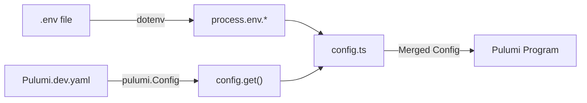

# Infrastructure Deployment Guide

> 🌐 **[English](#english) | [中文](#中文)**

This directory contains Pulumi infrastructure-as-code for deploying the HTTP tunnel service to AWS.

## English

### Table of Contents

- [Quick Start](#quick-start)
- [Architecture Overview](#architecture-overview)
- [Configuration](#configuration-architecture)
- [Setup Instructions](#setup-instructions)
- [Advanced Configuration](#advanced-configuration)
- [Deployment Options](#deployment-options)
- [Monitoring & Observability](#monitoring--observability)
- [Troubleshooting](#troubleshooting)
- [Security Best Practices](#security-best-practices)

### Architecture Overview

The infrastructure deploys the following AWS resources:

**Core Components**:
- **API Gateway WebSocket API**: Persistent connections for tunnel clients
- **API Gateway HTTP API**: Public-facing HTTP requests
- **Lambda Function**: Unified handler for all event types (ARM64 architecture)
- **DynamoDB Tables**:
  - `connections`: Active tunnel connections with GSI and TTL
  - `pending_requests`: Request/response correlation with DynamoDB Streams
- **EventBridge**:
  - Event bus for event-driven response notifications
  - Scheduled rules for cleanup tasks

**Optional Components**:
- **Custom Domains**: Route 53 + ACM certificates for branded URLs
- **CloudWatch Dashboard**: Metrics visualization
- **CloudWatch Alarms**: Automated alerting
- **AWS Budgets**: Cost tracking and alerts

**Resource Naming Convention**:
```
http-tunnel-{resource}-{environment}
```

Examples:
- `http-tunnel-handler-dev` (Lambda function)
- `http-tunnel-connections-dev` (DynamoDB table)
- `http-tunnel-ws-dev` (WebSocket API)

## Quick Start

```bash
cd infra

# 1. Copy environment template
cp .env.example .env

# 2. Edit .env with your AWS-specific values
nano .env

# 3. Install dependencies
npm install

# 4. Deploy
pulumi up
```

## Configuration Architecture

### Environment Variables (.env)

**Sensitive configuration is stored in `.env` file (gitignored)**:

```bash
# infra/.env (DO NOT COMMIT)
TUNNEL_DOMAIN_NAME=tunnel.example.com
TUNNEL_WEBSOCKET_DOMAIN_NAME=ws.example.com
TUNNEL_CERTIFICATE_ARN=arn:aws:acm:us-east-1:123456789012:certificate/cert-id
```

### Pulumi Stack Config

**Non-sensitive configuration in `Pulumi.dev.yaml` (safe to commit)**:

```yaml
config:
  aws:region: us-east-1
  aws:profile: your-profile
  http-tunnel:environment: dev
  http-tunnel:enableCustomDomain: "true"
  http-tunnel:lambdaArchitecture: arm64
  http-tunnel:lambdaMemorySize: "256"
  http-tunnel:lambdaTimeout: "30"
```

### How It Works

1. **dotenv** loads variables from `infra/.env`
2. **config.ts** reads from `process.env` with fallback to Pulumi config
3. **Pulumi** uses the merged configuration to deploy

**Priority**: Environment variables > Pulumi config > defaults

## Setup Instructions

### Prerequisites

- Node.js 18+
- Pulumi CLI installed
- AWS CLI configured
- ACM certificate (for custom domain)

### Option 1: With Custom Domain

1. **Request ACM Certificate**:
   ```bash
   aws acm request-certificate \
     --domain-name "*.example.com" \
     --subject-alternative-names "example.com" \
     --validation-method DNS \
     --region us-east-1
   ```

2. **Validate certificate** (create DNS records as instructed by AWS)

3. **Get Certificate ARN**:
   ```bash
   aws acm list-certificates --region us-east-1
   ```

4. **Create `.env` file**:
   ```bash
   cp .env.example .env
   ```

5. **Edit `.env`** with your values:
   ```bash
   TUNNEL_DOMAIN_NAME=tunnel.example.com
   TUNNEL_WEBSOCKET_DOMAIN_NAME=ws.example.com
   TUNNEL_CERTIFICATE_ARN=arn:aws:acm:us-east-1:123456789012:certificate/abc-123
   ```

6. **Deploy**:
   ```bash
   npm install
   pulumi up
   ```

7. **Create DNS Records** (after deployment):
   ```bash
   # Get target domains
   pulumi stack output httpDomainTarget
   pulumi stack output websocketDomainTarget

   # Create CNAME records in your DNS provider:
   # tunnel.example.com    -> d-xxxxxxxxx.execute-api.us-east-1.amazonaws.com
   # ws.example.com        -> d-yyyyyyyyy.execute-api.us-east-1.amazonaws.com
   ```

### Option 2: Without Custom Domain

1. **Disable custom domain in `Pulumi.dev.yaml`**:
   ```yaml
   http-tunnel:enableCustomDomain: "false"
   ```

2. **Skip `.env` file** (not needed)

3. **Deploy**:
   ```bash
   npm install
   pulumi up
   ```

4. **Use AWS-generated endpoints**:
   ```bash
   pulumi stack output websocketApiEndpoint
   pulumi stack output httpApiEndpoint
   ```

## File Structure

```
infra/
├── .env                  # Your sensitive config (gitignored) ⚠️
├── .env.example          # Template with placeholders (committed)
├── Pulumi.yaml           # Base configuration (committed)
├── Pulumi.dev.yaml       # Dev non-sensitive config (committed)
├── Pulumi.prod.yaml      # Prod non-sensitive config (committed)
├── index.ts              # Main Pulumi program
├── src/
│   ├── config.ts         # Config loader (reads .env + Pulumi config)
│   ├── dynamodb.ts       # DynamoDB tables
│   ├── lambda.ts         # Lambda function
│   ├── apigateway.ts     # API Gateway (deprecated - moved to index.ts)
│   ├── iam.ts            # IAM roles and policies
│   └── domain.ts         # Custom domain configuration
└── README.md             # This file
```

## Configuration Loading Flow



**Example**:
```typescript
// In config.ts
domainName: process.env.TUNNEL_DOMAIN_NAME ||  // Priority 1: .env file
            config.get("domainName") ||         // Priority 2: Pulumi config
            "tunnel.example.com"                // Priority 3: Default
```

## Security

### What's Gitignored

✅ **Automatically ignored**:
- `infra/.env` - Your actual sensitive values
- `.env` - Root level env file (if created)

### What's Committed

✅ **Safe to commit**:
- `.env.example` - Template with placeholders
- `Pulumi.dev.yaml` - Non-sensitive configuration
- `Pulumi.prod.yaml` - Non-sensitive configuration
- All TypeScript source files

### Verification

```bash
# Check what git will commit
git status

# Verify .env is ignored
git check-ignore infra/.env
# Should output: infra/.env

# Verify .env.example will be committed
git check-ignore infra/.env.example
# Should output nothing (not ignored)
```

## Multiple Environments

### Development
```bash
pulumi stack select dev
# Uses Pulumi.dev.yaml + infra/.env
pulumi up
```

### Production
```bash
pulumi stack select prod

# Create production .env
cp .env.example .env.prod
# Edit .env.prod with production values

# Update config.ts to load .env.prod for prod stack
# Or use environment-specific approach:
# PULUMI_STACK=prod make deploy
```

## Troubleshooting

### "Certificate ARN is required"

**Problem**: `.env` file missing or not loaded

**Solution**:
```bash
# Check if .env exists
ls -la infra/.env

# Verify it has content
cat infra/.env

# Check if env var is set
echo $TUNNEL_CERTIFICATE_ARN  # (run after `source infra/.env`)
```

### Values not loading from .env

**Problem**: dotenv not loading file

**Solution**:
```bash
# Verify dotenv is installed
npm list dotenv

# Check file path in config.ts
# Should be: dotenv.config({ path: __dirname + "/../.env" })
```

### Pulumi config vs .env confusion

**Clarification**:
- `.env` = Environment variables (sensitive data)
- `Pulumi.*.yaml` = Stack configuration (non-sensitive settings)
- Both are merged in `config.ts`

## Best Practices

1. **Never commit `.env` files** - Always use `.env.example` as template
2. **Use different `.env` files for different stacks** (dev vs prod)
3. **Rotate certificates** before they expire
4. **Use AWS Secrets Manager** for production secrets (future improvement)
5. **Document required env vars** in `.env.example`

## Clean Up

```bash
# Destroy all infrastructure
pulumi destroy

# Remove local state
rm -rf .env Pulumi.*.yaml
```

⚠️ **Warning**: `pulumi destroy` deletes all DynamoDB data!

## Migration from Old Config

If you have sensitive values in `Pulumi.dev.yaml`:

```bash
# 1. Extract sensitive values
grep -E "domainName|certificateArn" Pulumi.dev.yaml

# 2. Add them to .env
echo "TUNNEL_DOMAIN_NAME=your-domain" >> infra/.env
echo "TUNNEL_WEBSOCKET_DOMAIN_NAME=ws.your-domain" >> infra/.env
echo "TUNNEL_CERTIFICATE_ARN=arn:aws:..." >> infra/.env

# 3. Remove from Pulumi.dev.yaml
# (Keep only non-sensitive config)

# 4. Test
pulumi preview
```
