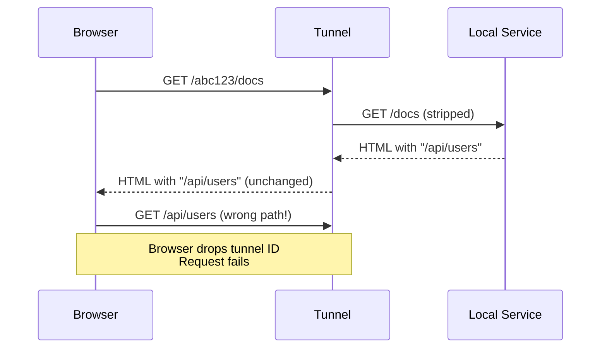
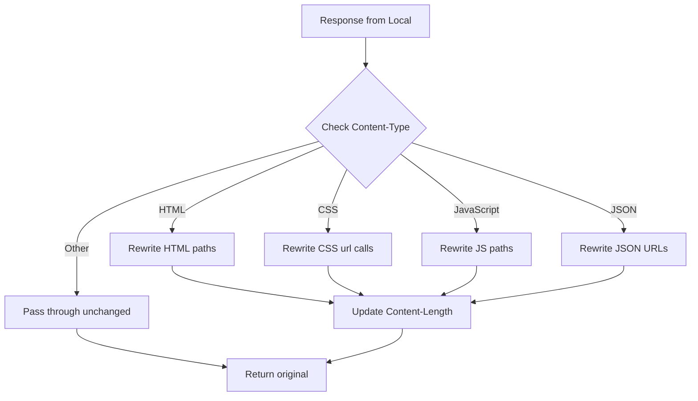

# Content Rewriting for Path-Based Routing

## Problem Statement

With path-based routing (`https://tunnel.example.com/abc123/docs`), HTML pages and JSON APIs that contain absolute paths will break:

### Example Problem

**Request**: `GET https://tunnel.example.com/abc123/docs`

**HTML Response from Local Service**:

```html
<!DOCTYPE html>
<html>
<head>
  <link rel="stylesheet" href="/static/style.css">
  <script src="/static/app.js"></script>
</head>
<body>
  <a href="/api/users">Users</a>
  <a href="/docs/oauth2-redirect">OAuth</a>
  
</body>
</html>
```

**Problem**: Browser interprets these paths as:

- `/static/style.css` → `https://tunnel.example.com/static/style.css` ❌
- Should be: `https://tunnel.example.com/abc123/static/style.css` ✓

### Why This Happens



The local service doesn't know about the tunnel ID prefix, so it generates absolute paths without it.

## Solution Approaches

### Option 1: Content Rewriting (Recommended for Compatibility)

Intercept and rewrite response content to inject tunnel ID into absolute paths.

**Pros**:

- Works with existing applications (no code changes needed)
- Transparent to local service
- Handles HTML, CSS, JavaScript, JSON

**Cons**:

- Performance overhead (parsing and rewriting)
- Complex regex patterns needed
- May break binary content or checksums
- Content-Length header needs updating

### Option 2: Base Tag Injection (HTML Only)

Inject `<base href="/abc123/">` into HTML documents.

**Pros**:

- Simple implementation
- Standard HTML feature
- Browser handles path resolution

**Cons**:

- Only works for HTML (not JSON APIs)
- Doesn't work for JavaScript fetch/xhr calls
- May conflict with existing base tags

### Option 3: Proxy Headers (Application-Aware)

Send headers to local service with tunnel context.

**Pros**:

- Clean solution
- No content modification
- Efficient

**Cons**:

- Requires local service to be "tunnel-aware"
- Not transparent
- Breaks existing applications

### Option 4: Subdomain Routing (Previous Approach)

Use `https://abc123.tunnel.example.com` instead of paths.

**Pros**:

- No content rewriting needed
- Transparent to applications

**Cons**:

- **Requires wildcard DNS** (not available - original problem!)
- Wildcard TLS certificate needed

## Recommended Solution: Smart Content Rewriting

Implement selective content rewriting based on Content-Type:



## Implementation Design

### 1. Content Type Detection

```rust
fn should_rewrite_content(content_type: &str) -> bool {
    matches!(content_type,
        "text/html" |
        "text/css" |
        "application/javascript" |
        "text/javascript" |
        "application/json"
    )
}
```

### 2. Path Rewriting Patterns

#### HTML Content

**Patterns to rewrite**:

```regex
href="(/[^"]*)"          → href="/abc123$1"
src="(/[^"]*)"           → src="/abc123$1"
action="(/[^"]*)"        → action="/abc123$1"
<form[^>]+action="(/     → inject tunnel ID
```

**Edge Cases**:

- ✓ Preserve external URLs: `href="http://..."` (unchanged)
- ✓ Preserve anchors: `href="#section"` (unchanged)
- ✓ Preserve relative paths: `href="page.html"` (unchanged)
- ✓ Preserve protocol-relative: `href="//cdn...."` (unchanged)

#### CSS Content

```regex
url\((['"]?)(/[^'"()]+)\1\)  → url($1/abc123$2$1)
```

**Example**:

```css
/* Before */
background: url('/images/bg.png');

/* After */
background: url('/abc123/images/bg.png');
```

#### JavaScript Content

**Challenge**: JavaScript is complex - multiple ways to construct URLs:

```javascript
fetch('/api/data')
location.href = '/page'
const url = '/path' + params
```

**Approach**: Use simple string replacement for common patterns:

```regex
['"]/(api|v\d+|[a-z-]+)/  → "$1/abc123/$2
```

**Better**: Don't rewrite JavaScript - handle at application level or use base tag.

#### JSON Content

**For API responses** (e.g., OpenAPI specs):

```json
{
  "openapi": "3.0.0",
  "servers": [
    {"url": "/api/v1"}  ← Needs rewriting
  ],
  "paths": {
    "/users": {...}     ← Needs rewriting
  }
}
```

### 3. Implementation in ResponseHandler

**File**: `apps/handler/src/handlers/response.rs`

```rust
use regex::Regex;

/// Rewrite absolute paths in response content to include tunnel ID
fn rewrite_response_content(
    body: &str,
    content_type: &str,
    tunnel_id: &str,
) -> Result<String, Error> {
    if !should_rewrite_content(content_type) {
        return Ok(body.to_string());
    }

    let prefix = format!("/{}", tunnel_id);

    match content_type {
        "text/html" => rewrite_html(body, &prefix),
        "text/css" => rewrite_css(body, &prefix),
        "application/json" => rewrite_json(body, &prefix),
        _ => Ok(body.to_string()),
    }
}

fn rewrite_html(body: &str, prefix: &str) -> Result<String, Error> {
    // Regex patterns for HTML attributes
    let patterns = vec![
        // href="/path" → href="/abc123/path"
        (r#"href="(/[^"]*)""#, format!(r#"href="{prefix}$1""#)),
        // src="/path" → src="/abc123/path"
        (r#"src="(/[^"]*)""#, format!(r#"src="{prefix}$1""#)),
        // action="/path" → action="/abc123/path"
        (r#"action="(/[^"]*)""#, format!(r#"action="{prefix}$1""#)),
    ];

    let mut result = body.to_string();
    for (pattern, replacement) in patterns {
        let re = Regex::new(pattern)?;
        result = re.replace_all(&result, replacement.as_str()).to_string();
    }

    Ok(result)
}

fn rewrite_css(body: &str, prefix: &str) -> Result<String, Error> {
    // url(/path) or url('/path') or url("/path")
    let re = Regex::new(r#"url\((['"]?)(/[^'"()]+)\1\)"#)?;
    let result = re.replace_all(body, |caps: &regex::Captures| {
        let quote = &caps[1];
        let path = &caps[2];
        format!("url({quote}{prefix}{path}{quote})")
    });

    Ok(result.to_string())
}

fn rewrite_json(body: &str, prefix: &str) -> Result<String, Error> {
    // For JSON, we need to be more careful
    // Only rewrite string values that look like paths
    let re = Regex::new(r#""(/[a-zA-Z0-9/_-]+)""#)?;
    let result = re.replace_all(body, |caps: &regex::Captures| {
        let path = &caps[1];
        // Don't rewrite if it's already prefixed
        if path.starts_with(&format!("/{}", prefix.trim_start_matches('/'))) {
            caps[0].to_string()
        } else {
            format!(r#""{prefix}{path}""#)
        }
    });

    Ok(result.to_string())
}
```

### 4. Integration Points

**Where to Apply Rewriting**:

#### Option A: In ForwardingHandler (Before Sending Response)

```rust
// apps/handler/src/handlers/forwarding.rs
pub async fn handle_forwarding(...) -> Result<ApiGatewayProxyResponse, Error> {
    // ... forward request to agent ...
    // ... wait for response ...

    let response = wait_for_response(&clients.dynamodb, &request_id).await?;

    // Rewrite response content
    let rewritten_body = if should_rewrite_content(&response.content_type) {
        rewrite_response_content(&response.body, &response.content_type, &tunnel_id)?
    } else {
        response.body.clone()
    };

    // Update Content-Length header
    let mut headers = response.headers.clone();
    headers.insert(
        "Content-Length".to_string(),
        vec![rewritten_body.len().to_string()]
    );

    Ok(build_api_gateway_response_with_body(response, rewritten_body, headers))
}
```

#### Option B: In Agent (Before Sending Response)

```rust
// apps/forwarder/src/main.rs
async fn handle_http_request(request: HttpRequest, tunnel_id: &str) -> HttpResponse {
    // ... forward to local service ...
    let response = local_client.request(req).await?;

    // Rewrite response body
    let body = if should_rewrite(&content_type) {
        rewrite_content(&response_body, &content_type, tunnel_id)?
    } else {
        response_body
    };

    // Return rewritten response
    HttpResponse { body, .. }
}
```

**Recommendation**: Implement in **ForwardingHandler** (Lambda) because:

- Centralized logic
- Easier to update/maintain
- Agent stays simple
- Can leverage Lambda's compute for regex processing

### 5. Performance Considerations

**Impact**:

- HTML parsing: ~10-50ms for typical pages (5-50KB)
- Regex operations: ~1-5ms per pattern
- Content-Length recalculation: negligible

**Optimization**:

- Only rewrite text content (skip images, videos)
- Cache compiled regexes
- Stream processing for large responses (>1MB)
- Consider response size limits (API Gateway max: 10MB)

### 6. Edge Cases and Special Handling

#### Already-Prefixed Paths

```rust
// Don't double-prefix
if path.starts_with(&format!("/{}/", tunnel_id)) {
    return Ok(body); // Already rewritten
}
```

#### Data URLs

```html

<!-- Don't rewrite data: URLs -->
```

#### External URLs

```html
<a href="https://external.com/path">
<!-- Don't rewrite external URLs -->
```

#### JavaScript Dynamic URLs

```javascript
const apiBase = '/api';  // ← Rewrite this
const url = apiBase + '/users';  // ← Can't easily rewrite this
```

**Solution**: Use base tag or document that SPAs need tunnel-aware configuration.

### 7. Alternative: Base Tag Injection for HTML

**Simpler Approach for HTML**:

```rust
fn inject_base_tag(html: &str, tunnel_id: &str) -> String {
    let base_tag = format!(r#"<base href="/{tunnel_id}/">"#);

    // Inject after <head> tag
    if let Some(pos) = html.find("<head>") {
        let mut result = html.to_string();
        result.insert_str(pos + 6, &base_tag);
        return result;
    }

    html.to_string()
}
```

**Browser Behavior**:

```html
<base href="/abc123/">
<a href="/api/users">  <!-- Browser resolves to /abc123/api/users -->
```

**Limitations**:

- Only works in HTML
- JavaScript `fetch('/api')` might not respect base tag (depends on implementation)

### 8. Hybrid Solution (Recommended)

```rust
fn rewrite_response(
    body: &str,
    content_type: &str,
    tunnel_id: &str,
    rewrite_strategy: RewriteStrategy,
) -> Result<String, Error> {
    match (content_type, rewrite_strategy) {
        ("text/html", RewriteStrategy::BaseTag) => {
            // Simple: inject <base> tag
            inject_base_tag(body, tunnel_id)
        }
        ("text/html", RewriteStrategy::FullRewrite) => {
            // Comprehensive: rewrite all paths
            rewrite_html_paths(body, tunnel_id)
        }
        ("text/css", _) => {
            rewrite_css_urls(body, tunnel_id)
        }
        ("application/json", _) => {
            // Conservative: only rewrite obvious path fields
            rewrite_json_paths(body, tunnel_id)
        }
        _ => Ok(body.to_string()),
    }
}

pub enum RewriteStrategy {
    None,           // No rewriting (pass through)
    BaseTag,        // HTML: inject base tag only
    FullRewrite,    // HTML: rewrite all paths
}
```

**Configuration**:

```rust
// In config or per-request header
const REWRITE_STRATEGY: RewriteStrategy = RewriteStrategy::BaseTag;
```

### 9. Header-Based Control

Allow client to control rewriting:

```
X-Tunnel-Rewrite: full|base|none
```

**Example**:

```bash
# Request with no rewriting
curl -H "X-Tunnel-Rewrite: none" https://tunnel.example.com/abc123/api/data

# Request with full HTML rewriting
curl -H "X-Tunnel-Rewrite: full" https://tunnel.example.com/abc123/docs
```

### 10. Implementation Plan

#### Phase 1: Base Tag Injection (Quick Win)

1. Detect HTML responses by Content-Type
2. Inject `<base href="/tunnel-id/">` after `<head>` tag
3. Update Content-Length header
4. Test with various HTML pages

**Files to Modify**:

- `apps/handler/src/lib.rs` - Add `inject_base_tag()` function
- `apps/handler/src/handlers/forwarding.rs` - Apply rewriting before returning response
- `crates/common/Cargo.toml` - Add `regex = "1.10"` dependency

**Estimated Effort**: 1-2 hours

#### Phase 2: Full Path Rewriting (Comprehensive)

1. Implement regex-based rewriting for HTML, CSS, JSON
2. Add unit tests for each content type
3. Handle edge cases (external URLs, data URLs, etc.)
4. Performance testing with large responses

**Files to Modify**:

- `apps/handler/src/content_rewrite.rs` - New module
- `apps/handler/src/lib.rs` - Export rewrite functions
- `apps/handler/src/handlers/forwarding.rs` - Apply comprehensive rewriting

**Estimated Effort**: 4-6 hours

#### Phase 3: Configuration & Control

1. Add rewrite strategy configuration
2. Implement X-Tunnel-Rewrite header support
3. Add metrics for rewrite performance
4. Document usage in README

**Estimated Effort**: 2-3 hours

### 11. Testing Strategy

#### Unit Tests

```rust
#[test]
fn test_inject_base_tag() {
    let html = r#"<html><head><title>Test</title></head><body></body></html>"#;
    let result = inject_base_tag(html, "abc123");
    assert!(result.contains(r#"<base href="/abc123/">"#));
}

#[test]
fn test_rewrite_html_href() {
    let html = r#"<a href="/api/users">Users</a>"#;
    let result = rewrite_html_paths(html, "abc123");
    assert_eq!(result, r#"<a href="/abc123/api/users">Users</a>"#);
}

#[test]
fn test_dont_rewrite_external_url() {
    let html = r#"<a href="https://example.com/page">External</a>"#;
    let result = rewrite_html_paths(html, "abc123");
    assert_eq!(result, html); // Unchanged
}

#[test]
fn test_rewrite_css_url() {
    let css = r#"background: url('/images/bg.png');"#;
    let result = rewrite_css_urls(css, "abc123");
    assert_eq!(result, r#"background: url('/abc123/images/bg.png');"#);
}
```

#### Integration Tests

```bash
# 1. Start test app with HTML/CSS/JS
make run-testapp

# 2. Start forwarder
ttf

# 3. Access HTML page
curl https://tunnel.example.com/abc123/docs > page.html

# 4. Verify paths are rewritten
grep -o 'href="/abc123/' page.html | wc -l  # Should be > 0

# 5. Test in browser
open https://tunnel.example.com/abc123/docs
# Click links - should work

# 6. Check Network tab
# All requests should have /abc123/ prefix
```

### 12. Potential Issues and Mitigations

#### Issue 1: Content-Length Mismatch

**Problem**: After rewriting, body size changes but Content-Length header doesn't match.

**Solution**:

```rust
// Recalculate Content-Length
let new_length = rewritten_body.len();
headers.insert("Content-Length", vec![new_length.to_string()]);

// Remove Transfer-Encoding: chunked if present
headers.remove("Transfer-Encoding");
```

#### Issue 2: Gzip/Compressed Content

**Problem**: Can't rewrite compressed content without decompressing.

**Solution**:

```rust
// Check for Content-Encoding
if headers.get("Content-Encoding").is_some() {
    // Option 1: Decompress, rewrite, recompress
    // Option 2: Skip rewriting for compressed content
    // Option 3: Remove Accept-Encoding from upstream request
    return Ok(body); // Skip rewriting
}
```

**Recommendation**: Strip `Accept-Encoding` from request to local service to avoid compression.

#### Issue 3: Single-Page Applications (SPAs)

**Problem**: SPAs use client-side routing and JavaScript fetch calls.

**Solution**:

```javascript
// Local app needs to be configured with base path
const API_BASE = window.location.pathname.split('/').slice(0, 2).join('/');
// For /abc123/app → API_BASE = "/abc123"

fetch(`${API_BASE}/api/users`)
```

**Document**: SPAs need minimal configuration to be tunnel-aware.

#### Issue 4: WebSocket URLs in JavaScript

**Problem**: `ws://localhost:8080` in JavaScript won't work through tunnel.

**Solution**:

- Document limitation: WebSocket passthrough not supported in path-based routing
- Alternative: Use subdomain routing for apps with WebSocket requirements

### 13. Configuration Options

Add to Pulumi config:

```yaml
http-tunnel:enableContentRewrite: "true"    # Enable/disable feature
http-tunnel:rewriteStrategy: "base-tag"     # base-tag|full|none
http-tunnel:rewriteContentTypes:            # Which types to rewrite
  - "text/html"
  - "text/css"
  - "application/json"
```

### 14. Performance Optimization

```rust
// Cache compiled regexes (use lazy_static or once_cell)
use once_cell::sync::Lazy;

static HTML_HREF_REGEX: Lazy<Regex> = Lazy::new(|| {
    Regex::new(r#"href="(/[^"]*)""#).unwrap()
});

// Use cow (clone-on-write) for unchanged content
use std::borrow::Cow;

fn rewrite_html<'a>(body: &'a str, prefix: &str) -> Cow<'a, str> {
    HTML_HREF_REGEX.replace_all(body, format!(r#"href="{prefix}$1""#))
}
```

### 15. Monitoring and Debugging

**Add Metrics**:

```rust
info!(
    "Content rewrite: type={}, original_size={}, rewritten_size={}, duration_ms={}",
    content_type, original.len(), rewritten.len(), duration.as_millis()
);
```

**Debug Header**:

```
X-Tunnel-Rewrite-Applied: true
X-Tunnel-Original-Length: 1234
X-Tunnel-Rewritten-Length: 1456
```

### 16. Rollout Strategy

**Phase 1**:

- Implement base tag injection only
- Default: enabled
- Extensive testing with real apps

**Phase 2**:

- Add full HTML path rewriting
- Add CSS rewriting
- Default: full rewrite

**Phase 3**:

- JSON rewriting for API specs
- JavaScript rewriting (experimental)
- Default: full rewrite

### 17. Alternative: Subdomain-Per-Request

**Crazy Idea**: Generate a subdomain for each tunnel that points to path:

**DNS Wildcard Record**:

```
*.tunnel.example.com → tunnel.example.com
```

**Lambda Logic**:

```
Request to: https://abc123.tunnel.example.com/docs
Extract tunnel_id from: subdomain (abc123)
Forward to local: /docs
```

**Issue**: Still requires wildcard DNS (original problem!).

### 18. Documentation for Users

**In README.md**:

```markdown
## Path-Based Routing Considerations

When using path-based URLs (`https://tunnel.example.com/abc123/`), web applications
that use absolute paths may need adjustments:

### Automatic Content Rewriting

HTTP Tunnel can automatically rewrite HTML content to inject the tunnel ID prefix:

- HTML `href`, `src`, `action` attributes
- CSS `url()` references
- JSON path fields (OpenAPI specs, etc.)

Enable in `infra/.env`:
```bash
TUNNEL_ENABLE_CONTENT_REWRITE=true
```

### Application-Side Solutions

For single-page applications, configure the base path:

```javascript
// Detect tunnel ID from URL
const basePath = window.location.pathname.split('/').slice(0, 2).join('/');
// /abc123/app → basePath = "/abc123"

// Use in API calls
fetch(`${basePath}/api/data`)
```

### Limitations

- WebSocket connections through tunnel: Not supported in path-based mode
- Binary content: Not rewritten (images, PDFs work as-is)
- Highly dynamic JavaScript: May need manual configuration

```

## Recommendation

**Start with Base Tag Injection**:
- Simple to implement
- Works for 80% of use cases
- Low performance impact
- Easy to debug

**Add Full Rewriting if needed**:
- Based on user feedback
- For apps that don't respect base tag
- Can be opt-in feature

**Document Limitations**:
- SPAs may need minimal config
- WebSocket passthrough not supported
- Recommend subdomain routing for complex apps (if wildcard DNS available)

## Next Steps

1. Implement base tag injection (Phase 1)
2. Test with TodoMVC app and real web apps
3. Gather feedback on what breaks
4. Implement full rewriting only if base tag insufficient
5. Add configuration options for enabling/disabling

---

**Complexity**: Medium
**Impact**: High (enables real-world usage)
**Priority**: High (current limitation affects usability)
