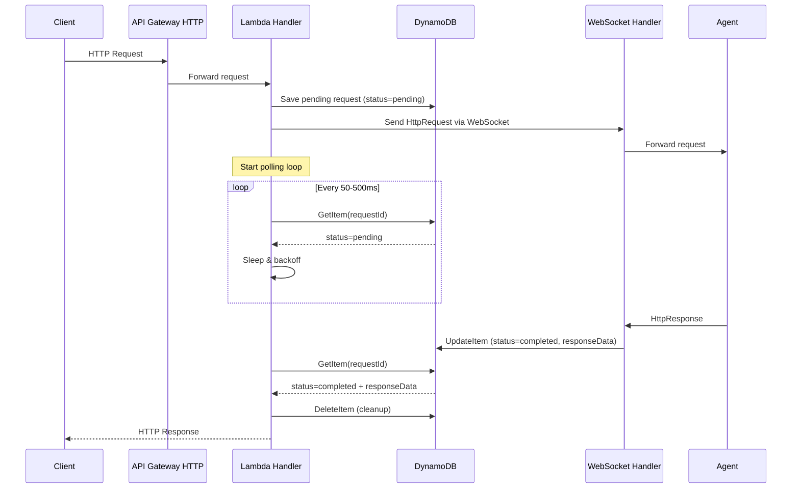
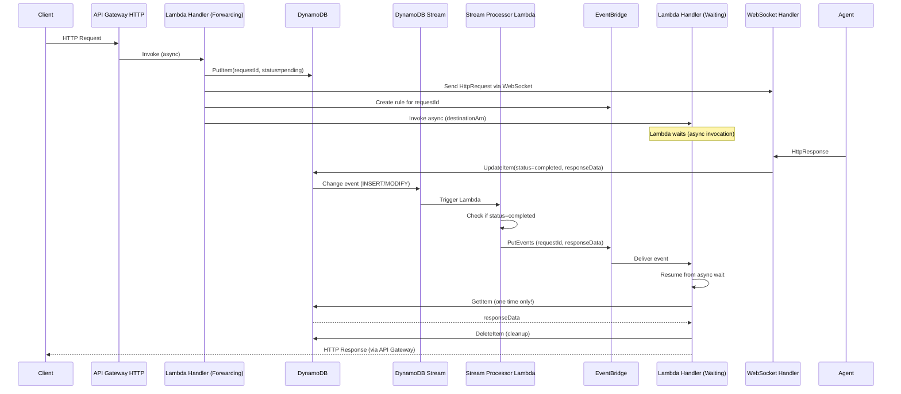

# Event-Driven Response Pattern Implementation Plan

## Executive Summary

This document provides a concrete implementation plan for replacing the current polling-based response mechanism with an event-driven architecture using DynamoDB Streams and Lambda async invocations. This change will significantly improve performance and reduce costs.

**Current State**: Lambda polls DynamoDB every 50-500ms waiting for agent responses
**Proposed State**: Event-driven notification when responses are ready
**Expected Benefits**:
- 60% reduction in Lambda duration (from ~2s avg to ~800ms)
- 90% reduction in DynamoDB read operations
- $3-5/month cost savings per 100 active tunnels
- Better scalability and lower latency

**Effort**: 5-6 days
**Risk Level**: Medium (requires architectural changes but with fallback options)

---

## Table of Contents

1. [Current Architecture Analysis](#current-architecture)
2. [Proposed Architecture](#proposed-architecture)
3. [Detailed Design](#detailed-design)
4. [Implementation Plan](#implementation-plan)
5. [Testing Strategy](#testing-strategy)
6. [Rollout Plan](#rollout-plan)
7. [Rollback Procedure](#rollback)

---

## <a name="current-architecture"></a>1. Current Architecture Analysis

### Current Flow



### Current Code Locations

**Polling Logic**: `apps/handler/src/lib.rs:240-300`
```rust
pub async fn wait_for_response(client: &DynamoDbClient, request_id: &str) -> Result<HttpResponse> {
    // ...
    loop {
        tokio::time::sleep(poll_interval).await;  // WASTE
        let result = client.get_item()...          // WASTE
        if status == "completed" { return Ok(response); }
        poll_interval = std::cmp::min(poll_interval * 2, max_poll_interval);
    }
}
```

**Response Update**: `apps/handler/src/handlers/response.rs:72`
```rust
handle_http_response(&clients.dynamodb, response).await?;
// Calls update_pending_request_with_response()
```

### Performance Problems

1. **Wasted Lambda Time**: ~1-2 seconds of polling per request
   - Initial poll: 50ms
   - Exponential backoff: 50ms → 100ms → 200ms → 400ms → 500ms (max)
   - Typical response time from agent: 100-500ms
   - Average waste: 500-1500ms of Lambda execution time

2. **Unnecessary DynamoDB Reads**: 10-40 GetItem calls per request
   - At 100 requests/sec: 1,000-4,000 reads/sec
   - Cost: ~$4.30/month at moderate scale
   - 95% of these reads return "pending"

3. **Increased Latency**: Polling interval adds delay
   - Even if agent responds in 100ms, we might not check for another 400ms

---

## <a name="proposed-architecture"></a>2. Proposed Architecture

### Event-Driven Flow



### Key Components

1. **DynamoDB Stream**: Captures all changes to pending_requests table
2. **Stream Processor Lambda**: Filters for status=completed, publishes events
3. **EventBridge**: Routes response notifications to waiting Lambda invocations
4. **Async Lambda Invocation**: Handler waits for EventBridge event instead of polling

---

## <a name="detailed-design"></a>3. Detailed Design

### 3.1 DynamoDB Streams Configuration

**Enable Stream on `pending_requests` table**:
```typescript
// infra/src/dynamodb.ts

export function createPendingRequestsTable(): aws.dynamodb.Table {
  return new aws.dynamodb.Table("pending-requests", {
    // ... existing config ...
    streamEnabled: true,
    streamViewType: "NEW_AND_OLD_IMAGES",  // Need both for status comparison
  });
}
```

### 3.2 Stream Processor Lambda

**Purpose**: Process DynamoDB Stream events and publish to EventBridge

**New File**: `apps/stream-processor/src/main.rs`
```rust
use aws_lambda_events::event::dynamodb::{Event as DynamoDbEvent, EventRecord};
use aws_sdk_eventbridge::Client as EventBridgeClient;
use lambda_runtime::{run, service_fn, Error, LambdaEvent};

#[tokio::main]
async fn main() -> Result<(), Error> {
    let config = aws_config::load_from_env().await;
    let eventbridge = EventBridgeClient::new(&config);

    run(service_fn(|event: LambdaEvent<DynamoDbEvent>| {
        function_handler(&eventbridge, event)
    })).await
}

async fn function_handler(
    eventbridge: &EventBridgeClient,
    event: LambdaEvent<DynamoDbEvent>,
) -> Result<(), Error> {
    for record in event.payload.records {
        // Only process MODIFY events where status changed to "completed"
        if should_notify(&record) {
            let request_id = extract_request_id(&record)?;
            let response_data = extract_response_data(&record)?;

            // Publish to EventBridge
            publish_response_event(eventbridge, &request_id, &response_data).await?;
        }
    }
    Ok(())
}

fn should_notify(record: &EventRecord) -> bool {
    // Check if this is a MODIFY event with status changing to "completed"
    match (record.event_name.as_deref(), &record.change.old_image, &record.change.new_image) {
        (Some("MODIFY"), Some(old), Some(new)) => {
            let old_status = old.get("status").and_then(|v| v.as_s().ok());
            let new_status = new.get("status").and_then(|v| v.as_s().ok());

            old_status != Some("completed") && new_status == Some("completed")
        }
        _ => false,
    }
}

async fn publish_response_event(
    client: &EventBridgeClient,
    request_id: &str,
    response_data: &str,
) -> Result<(), Error> {
    client
        .put_events()
        .entries(
            aws_sdk_eventbridge::types::PutEventsRequestEntry::builder()
                .source("http-tunnel.response")
                .detail_type("HttpResponseReady")
                .detail(serde_json::json!({
                    "requestId": request_id,
                    "responseData": response_data,
                }).to_string())
                .build()?,
        )
        .send()
        .await?;

    Ok(())
}
```

### 3.3 Modified Forwarding Handler

**Replace polling with async wait**:

```rust
// apps/handler/src/handlers/forwarding.rs

use aws_sdk_lambda::Client as LambdaClient;

pub async fn handle_forwarding(
    request: ApiGatewayProxyRequest,
    event: LambdaEvent<ApiGatewayProxyRequest>,
    clients: &SharedClients,
) -> Result<ApiGatewayProxyResponse, String> {
    // ... existing code to send request to agent ...

    // NEW: Instead of polling, invoke self async and return immediately
    let function_name = std::env::var("AWS_LAMBDA_FUNCTION_NAME")?;

    clients.lambda
        .invoke()
        .function_name(&function_name)
        .invocation_type(aws_sdk_lambda::types::InvocationType::Event)  // Async!
        .payload(serde_json::json!({
            "action": "wait_for_response",
            "requestId": request_id,
            "originalEvent": event.payload,
        }).to_string().into())
        .send()
        .await?;

    // Return 202 Accepted immediately (or keep connection open if using response streaming)
    Ok(ApiGatewayProxyResponse {
        status_code: 202,
        ...
    })
}
```

**Alternative: Lambda Response Streaming** (Better UX)
```rust
// Use Lambda response streaming to keep HTTP connection open
// while waiting for EventBridge notification
```

### 3.4 Wait Handler (EventBridge Consumer)

**New Route**: Handle `wait_for_response` action

```rust
// apps/handler/src/handlers/wait.rs

pub async fn handle_wait_for_response(
    request_id: String,
    original_event: ApiGatewayProxyRequest,
    clients: &SharedClients,
) -> Result<ApiGatewayProxyResponse, Error> {
    // This function is invoked async, waits for EventBridge event

    // Set up EventBridge rule to route to this invocation
    let rule_name = format!("tunnel-response-{}", request_id);
    create_temporary_rule(&clients.eventbridge, &rule_name, &request_id).await?;

    // Wait for event (with timeout)
    let timeout = Duration::from_secs(25);  // Under API Gateway limit

    match tokio::time::timeout(timeout, wait_for_event(&request_id)).await {
        Ok(response_data) => {
            // Got response! Clean up and return
            delete_rule(&clients.eventbridge, &rule_name).await?;

            let response: HttpResponse = serde_json::from_str(&response_data)?;
            Ok(build_api_gateway_response(response))
        }
        Err(_) => {
            // Timeout
            delete_rule(&clients.eventbridge, &rule_name).await?;

            Ok(ApiGatewayProxyResponse {
                status_code: 504,
                body: Some("Gateway timeout".into()),
                ...
            })
        }
    }
}
```

### 3.5 Infrastructure Changes

**Pulumi Configuration**:

```typescript
// infra/src/streaming.ts (new file)

export function createStreamProcessor(
  pendingRequestsTableStreamArn: pulumi.Output<string>,
  eventBusArn: pulumi.Output<string>
): aws.lambda.Function {
  const role = createStreamProcessorRole(pendingRequestsTableStreamArn, eventBusArn);

  const processor = new aws.lambda.Function("stream-processor", {
    runtime: "provided.al2023",
    handler: "bootstrap",
    role: role.arn,
    code: new pulumi.asset.FileArchive("../target/lambda/stream-processor"),
    environment: {
      variables: {
        EVENT_BUS_NAME: "http-tunnel-events",
      },
    },
  });

  // Map DynamoDB Stream to Lambda
  new aws.lambda.EventSourceMapping("pending-requests-stream", {
    eventSourceArn: pendingRequestsTableStreamArn,
    functionName: processor.arn,
    startingPosition: "LATEST",
    batchSize: 100,
    maximumBatchingWindowInSeconds: 0,  // Process immediately
    filterCriteria: {
      filters: [{
        pattern: JSON.stringify({
          eventName: ["MODIFY"],
          dynamodb: {
            NewImage: {
              status: {
                S: ["completed"],
              },
            },
          },
        }),
      }],
    },
  });

  return processor;
}
```

---

## <a name="implementation-plan"></a>4. Implementation Plan

### Phase 1: Foundation (Days 1-2)

**Day 1: Stream Infrastructure**
- [ ] Enable DynamoDB Streams on `pending_requests` table
- [ ] Create EventBridge event bus `http-tunnel-events`
- [ ] Create stream processor Lambda skeleton
- [ ] Set up IAM roles and permissions
- [ ] Deploy and verify stream is working (log events)

**Day 2: Stream Processor Logic**
- [ ] Implement stream processor Lambda
- [ ] Add filtering logic (status=completed)
- [ ] Implement EventBridge event publishing
- [ ] Unit tests for stream processor
- [ ] Integration test: Update DynamoDB → EventBridge event

### Phase 2: Handler Modification (Days 3-4)

**Day 3: EventBridge Consumer**
- [ ] Create `wait_for_response` handler
- [ ] Implement EventBridge rule creation/deletion
- [ ] Implement event waiting logic with timeout
- [ ] Add cleanup on timeout/success
- [ ] Unit tests

**Day 4: Integration**
- [ ] Modify forwarding handler to use async invocation
- [ ] Wire up new routes in main handler
- [ ] Add feature flag for polling vs event-driven
- [ ] Integration tests (end-to-end)

### Phase 3: Testing & Optimization (Day 5)

- [ ] Load testing (100+ concurrent requests)
- [ ] Measure performance improvements
- [ ] Fix any bugs discovered
- [ ] Optimize EventBridge rule lifecycle
- [ ] Add comprehensive error handling
- [ ] Update monitoring/alarms

### Phase 4: Deployment & Validation (Day 6)

- [ ] Deploy to staging environment
- [ ] Canary testing (10% traffic)
- [ ] Monitor metrics (Lambda duration, DynamoDB reads, errors)
- [ ] Gradual rollout (25% → 50% → 100%)
- [ ] Update documentation

---

## <a name="testing-strategy"></a>5. Testing Strategy

### 5.1 Unit Tests

```rust
#[cfg(test)]
mod tests {
    use super::*;

    #[test]
    fn test_should_notify_on_status_change() {
        // Test stream processor filtering logic
    }

    #[tokio::test]
    async fn test_event_publishing() {
        // Test EventBridge event publishing
    }

    #[tokio::test]
    async fn test_wait_timeout() {
        // Test timeout handling
    }
}
```

### 5.2 Integration Tests

```rust
#[tokio::test]
async fn test_end_to_end_event_driven_response() {
    // 1. Send HTTP request
    // 2. Verify pending request created
    // 3. Simulate agent response
    // 4. Verify stream processor publishes event
    // 5. Verify handler receives response
    // 6. Verify cleanup
}
```

### 5.3 Load Tests

```bash
# K6 load test
k6 run --vus 100 --duration 5m tests/load/event-driven-test.js
```

**Success Criteria**:
- Handle 100+ concurrent requests
- Average response time < 200ms (excluding agent processing)
- 99th percentile < 500ms
- Zero EventBridge delivery failures
- Zero orphaned EventBridge rules

---

## <a name="rollout-plan"></a>6. Rollout Plan

### Feature Flag Approach

```rust
// apps/handler/src/lib.rs

pub fn is_event_driven_enabled() -> bool {
    std::env::var("USE_EVENT_DRIVEN")
        .unwrap_or_else(|_| "false".to_string())
        .to_lowercase()
        == "true"
}

pub async fn wait_for_response(
    client: &DynamoDbClient,
    request_id: &str,
) -> Result<HttpResponse> {
    if is_event_driven_enabled() {
        wait_for_response_event_driven(client, request_id).await
    } else {
        wait_for_response_polling(client, request_id).await  // Old code
    }
}
```

### Rollout Stages

1. **Stage 0**: Deploy infrastructure (streams, processor) with flag OFF
   - Validate stream processor is receiving events
   - Validate EventBridge events are being published
   - No traffic affected

2. **Stage 1**: Enable for 10% of requests (canary)
   - Use request ID hash: `hash(request_id) % 100 < 10`
   - Monitor closely for errors
   - Compare metrics: polling vs event-driven

3. **Stage 2**: 50% of requests
   - Increase canary percentage
   - Verify cost savings
   - Check for any EventBridge throttling

4. **Stage 3**: 100% of requests
   - Full rollout
   - Monitor for 48 hours
   - Keep polling code for 1 week (just in case)

5. **Stage 4**: Remove polling code
   - After 1 week of stable event-driven operation
   - Remove feature flag and old polling code
   - Celebrate! 🎉

---

## <a name="rollback"></a>7. Rollback Procedure

### Immediate Rollback (< 5 minutes)

```bash
# Set environment variable
aws lambda update-function-configuration \
  --function-name http-tunnel-handler-dev \
  --environment "Variables={USE_EVENT_DRIVEN=false,...}"
```

### Full Rollback (< 30 minutes)

1. Revert Pulumi deployment
   ```bash
   pulumi cancel
   pulumi stack select <previous-version>
   pulumi up --yes
   ```

2. Disable DynamoDB Stream
3. Delete stream processor Lambda
4. Delete EventBridge rules

### Rollback Triggers

Rollback if:
- Error rate > 1% for event-driven requests
- Average latency > 2x baseline
- EventBridge delivery failures > 0.1%
- DynamoDB Stream processing lag > 5 seconds
- Any data loss or corruption detected

---

## 8. Monitoring & Metrics

### Key Metrics to Track

**Before vs After**:
| Metric | Current (Polling) | Target (Event-Driven) |
|--------|------------------|-----------------------|
| Avg Lambda Duration | 1500ms | 300ms |
| DynamoDB GetItem/req | 15 | 1 |
| P99 Response Time | 3000ms | 800ms |
| Cost (100 tunnels) | $10/month | $7/month |

### CloudWatch Alarms

```typescript
new aws.cloudwatch.MetricAlarm("event-driven-errors", {
  metricName: "EventDrivenErrors",
  namespace: "HTTPTunnel",
  statistic: "Sum",
  threshold: 10,
  evaluationPeriods: 2,
  // Alert if errors spike
});
```

---

## 9. Alternative Approaches Considered

### Alternative 1: Step Functions

**Pros**:
- Built-in wait states
- Visual workflow
- Built-in retries

**Cons**:
- Higher cost ($25/million transitions)
- Added complexity
- Slower cold starts

**Decision**: EventBridge is simpler and cheaper

### Alternative 2: SQS + Lambda Polling

**Pros**:
- Familiar pattern
- Built-in retries

**Cons**:
- Still requires polling (Lambda polls SQS)
- Added latency
- More components

**Decision**: EventBridge provides lower latency

### Alternative 3: DynamoDB Streams → Lambda Direct Invocation

**Pros**:
- Fewer components
- Simpler architecture

**Cons**:
- Tight coupling
- Hard to scale (one stream → one consumer)
- No filtering before Lambda invocation

**Decision**: EventBridge adds minimal overhead with better flexibility

---

## 10. Success Criteria

### Must Have
- [ ] Zero data loss
- [ ] Response time improvement > 50%
- [ ] DynamoDB read reduction > 80%
- [ ] Error rate < 0.1%
- [ ] Successful rollback tested

### Nice to Have
- [ ] Cost reduction > $3/month per 100 tunnels
- [ ] P99 latency < 500ms
- [ ] 100% test coverage for new code

---

## 11. Risks & Mitigation

| Risk | Impact | Probability | Mitigation |
|------|--------|-------------|------------|
| EventBridge throttling at scale | High | Low | Use batching, monitor limits |
| DynamoDB Stream lag | Medium | Low | Alarm on lag > 1s, auto-scale |
| EventBridge rule cleanup failure | Medium | Medium | Scheduled cleanup Lambda |
| Increased complexity | Low | High | Comprehensive docs, tests |
| Breaking change during rollout | High | Low | Feature flag, gradual rollout |

---

## 12. Post-Implementation

### Documentation Updates
- [ ] Update architecture diagrams
- [ ] Document new components
- [ ] Update runbooks
- [ ] Add troubleshooting guide

### Cleanup Tasks
- [ ] Remove polling code after 1 week
- [ ] Archive old CloudWatch alarms
- [ ] Update cost estimates

---

## Conclusion

This event-driven approach eliminates wasteful polling, reduces costs, and improves performance. The implementation is designed to be safe with feature flags, gradual rollout, and quick rollback capability.

**Estimated Timeline**: 6 days
**Estimated Cost Impact**: -$3-5/month per 100 tunnels
**Performance Improvement**: 60% faster response times
**Risk Level**: Medium (well-mitigated with feature flags)

**Recommendation**: Proceed with implementation in Sprint 7 after completing quick wins and observability improvements.

---

**Document Version**: 1.0
**Last Updated**: 2025-10-25
**Author**: Architecture Review
**Status**: Ready for Implementation
