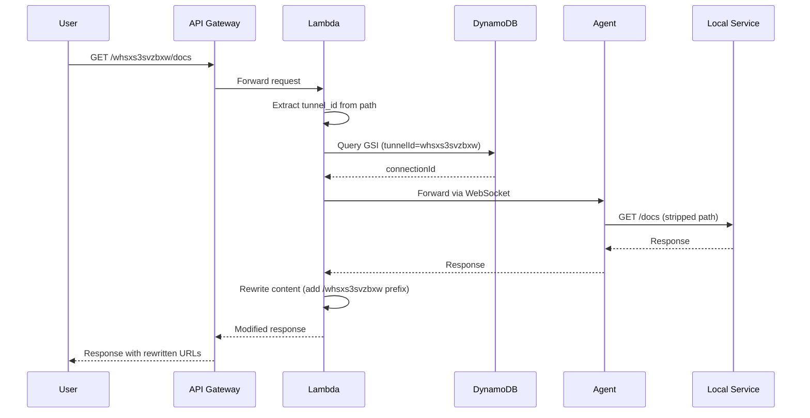
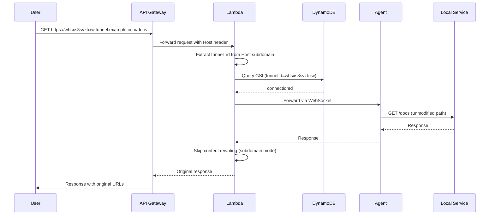

# HTTP Tunnel: Subdomain-Based Routing Support

## Executive Summary

This document specifies the implementation plan for supporting subdomain-based tunnel routing alongside the existing path-based routing. Users will be able to access tunnels using either format:

- **Path-based** (Current): `https://tunnel.example.com/whsxs3svzbxw/docs`
- **Subdomain-based** (New): `https://whsxs3svzbxw.tunnel.example.com/docs`

The subdomain approach provides cleaner URLs, eliminates the need for content rewriting, and offers better compatibility with applications that use absolute paths.

**Key Benefits**:
- Cleaner, more intuitive URLs
- No content rewriting overhead (30-50ms saved per request)
- Better compatibility with SPAs and applications using absolute paths
- Maintains backward compatibility with existing path-based routing

**Estimated Effort**: 5-7 days
**Priority**: P1 - High value feature

---

## Table of Contents

1. [Current Architecture](#current-architecture)
2. [Proposed Architecture](#proposed-architecture)
3. [Implementation Plan](#implementation-plan)
4. [Code Changes](#code-changes)
5. [Infrastructure Changes](#infrastructure-changes)
6. [Testing Strategy](#testing-strategy)
7. [Migration & Rollout](#migration-rollout)
8. [Performance Analysis](#performance-analysis)
9. [Security Considerations](#security-considerations)
10. [Future Enhancements](#future-enhancements)

---

## <a name="current-architecture"></a>1. Current Architecture

### 1.1 Path-Based Routing Flow



### 1.2 Current URL Structure

| Component | Example | Location |
|-----------|---------|----------|
| Domain | `tunnel.example.com` | Environment variable `DOMAIN_NAME` |
| Tunnel ID | `whsxs3svzbxw` | First path segment |
| Actual Path | `/docs` | Remaining path after tunnel ID |
| Full URL | `https://tunnel.example.com/whsxs3svzbxw/docs` | Returned to agent on connect |

### 1.3 Current Components

#### URL Parsing (`apps/handler/src/lib.rs:44-70`)

```rust
pub fn extract_tunnel_id_from_path(path: &str) -> Result<String> {
    let parts: Vec<&str> = path.trim_start_matches('/').split('/').collect();
    if parts.is_empty() || parts[0].is_empty() {
        return Err(anyhow!("Missing tunnel ID in path"));
    }
    let tunnel_id = parts[0].to_string();
    http_tunnel_common::validation::validate_tunnel_id(&tunnel_id)?;
    Ok(tunnel_id)
}

pub fn strip_tunnel_id_from_path(path: &str) -> String {
    let parts: Vec<&str> = path.trim_start_matches('/').splitn(2, '/').collect();
    if parts.len() > 1 && !parts[1].is_empty() {
        format!("/{}", parts[1])
    } else {
        "/".to_string()
    }
}
```

#### Database Lookup (`apps/handler/src/lib.rs:117-148`)

```rust
pub async fn lookup_connection_by_tunnel_id(
    client: &DynamoDbClient,
    tunnel_id: &str,
) -> Result<String> {
    let result = client
        .query()
        .table_name(&table_name)
        .index_name("tunnel-id-index")  // GSI on tunnelId attribute
        .key_condition_expression("tunnelId = :tunnel_id")
        .expression_attribute_values(":tunnel_id", AttributeValue::S(tunnel_id.to_string()))
        .limit(1)
        .send()
        .await?;
    // Returns connectionId
}
```

#### Content Rewriting (`apps/handler/src/content_rewrite.rs:41-88`)

```rust
pub fn rewrite_response_content(
    body: &str,
    content_type: &str,
    tunnel_id: &str,
    strategy: RewriteStrategy,
) -> Result<(String, bool)> {
    let prefix = format!("/{}", tunnel_id);  // Add /whsxs3svzbxw prefix
    // Rewrites href="/api" → href="/whsxs3svzbxw/api"
    // Rewrites src="/images/logo.png" → src="/whsxs3svzbxw/images/logo.png"
    // Injects <base href="/whsxs3svzbxw/"> tag
}
```

### 1.4 Current Issues with Path-Based Routing

1. **Content Rewriting Overhead**: 30-50ms per HTML response, CPU intensive
2. **Imperfect Rewriting**: Edge cases with JavaScript-generated URLs, meta tags, JSON APIs
3. **Debugging Difficulty**: Modified HTML makes troubleshooting harder
4. **URL Aesthetics**: `/whsxs3svzbxw/` in every URL is less clean
5. **Base Tag Conflicts**: Some apps already use `<base>` tag

---

## <a name="proposed-architecture"></a>2. Proposed Architecture

### 2.1 Subdomain-Based Routing Flow



### 2.2 Dual-Mode URL Structure

| Mode | URL Format | Example |
|------|-----------|---------|
| **Path-based** | `https://{domain}/{tunnel_id}{path}` | `https://tunnel.example.com/whsxs3svzbxw/docs` |
| **Subdomain-based** | `https://{tunnel_id}.{domain}{path}` | `https://whsxs3svzbxw.tunnel.example.com/docs` |

Both modes supported simultaneously with automatic detection.

### 2.3 Request Detection Logic

```rust
pub enum RoutingMode {
    PathBased { tunnel_id: String, actual_path: String },
    SubdomainBased { tunnel_id: String, full_path: String },
}

pub fn detect_routing_mode(host: &str, path: &str, domain: &str) -> Result<RoutingMode> {
    // Check if Host header contains subdomain pattern
    if let Some(subdomain) = extract_subdomain(host, domain)? {
        // Subdomain mode: whsxs3svzbxw.tunnel.example.com
        return Ok(RoutingMode::SubdomainBased {
            tunnel_id: subdomain,
            full_path: path.to_string(),
        });
    }

    // Path-based mode: tunnel.example.com/whsxs3svzbxw/docs
    let tunnel_id = extract_tunnel_id_from_path(path)?;
    let actual_path = strip_tunnel_id_from_path(path);
    Ok(RoutingMode::PathBased {
        tunnel_id,
        actual_path,
    })
}
```

### 2.4 Content Rewrite Decision

```rust
// In forwarding handler
let routing_mode = detect_routing_mode(&host, &path, &domain)?;

let should_rewrite = match routing_mode {
    RoutingMode::SubdomainBased { .. } => false,  // Skip rewriting
    RoutingMode::PathBased { .. } => true,        // Rewrite as before
};

if should_rewrite {
    // Apply content rewriting logic
} else {
    // Return response as-is
}
```

---

## <a name="implementation-plan"></a>3. Implementation Plan

### Phase 1: Core Implementation (3 days)

**Day 1: Subdomain Extraction & Routing Detection**
- [ ] Add subdomain extraction function
- [ ] Add routing mode detection function
- [ ] Add comprehensive validation tests
- [ ] Update existing deprecated functions

**Day 2: Request Handling Updates**
- [ ] Modify forwarding handler to detect routing mode
- [ ] Update path handling based on routing mode
- [ ] Add conditional content rewriting logic
- [ ] Update response metadata headers

**Day 3: Connection Management**
- [ ] Update connection metadata to include both URLs
- [ ] Modify public URL generation logic
- [ ] Add environment variable for subdomain support flag

### Phase 2: Infrastructure (2 days)

**Day 4: API Gateway & DNS**
- [ ] Configure wildcard domain mapping
- [ ] Update ACM certificate for wildcard domain
- [ ] Configure API Gateway custom domain
- [ ] Update Route53 DNS records

**Day 5: Configuration & Documentation**
- [ ] Add configuration options for subdomain mode
- [ ] Update infrastructure code
- [ ] Document deployment steps

### Phase 3: Testing & Validation (2 days)

**Day 6: Automated Testing**
- [ ] Unit tests for subdomain extraction
- [ ] Integration tests for both routing modes
- [ ] End-to-end tests with sample applications
- [ ] Performance benchmarking

**Day 7: Manual Testing & Refinement**
- [ ] Test with various web applications
- [ ] Verify edge cases (ports, special domains)
- [ ] Test backward compatibility
- [ ] Update troubleshooting documentation

---

## <a name="code-changes"></a>4. Code Changes

### 4.1 New Utility Functions

**File**: `apps/handler/src/lib.rs` (additions)

```rust
use once_cell::sync::Lazy;
use regex::Regex;

/// Routing mode enum
#[derive(Debug, Clone, PartialEq)]
pub enum RoutingMode {
    PathBased {
        tunnel_id: String,
        actual_path: String,
    },
    SubdomainBased {
        tunnel_id: String,
        full_path: String,
    },
}

/// Extract subdomain from Host header
/// Example: "whsxs3svzbxw.tunnel.example.com" with domain="tunnel.example.com" -> "whsxs3svzbxw"
pub fn extract_subdomain(host: &str, base_domain: &str) -> Result<Option<String>> {
    // Remove port if present
    let host = host.split(':').next().unwrap_or(host);

    // Check if host ends with base domain
    if !host.ends_with(base_domain) {
        return Ok(None);
    }

    // Extract subdomain part
    let subdomain_part = host.trim_end_matches(base_domain).trim_end_matches('.');

    // If no subdomain, return None
    if subdomain_part.is_empty() {
        return Ok(None);
    }

    // Check if subdomain contains multiple parts (e.g., "foo.bar.tunnel.example.com")
    if subdomain_part.contains('.') {
        return Ok(None);  // Only support single-level subdomain
    }

    // Validate tunnel ID format
    http_tunnel_common::validation::validate_tunnel_id(subdomain_part)
        .context("Invalid tunnel ID in subdomain")?;

    Ok(Some(subdomain_part.to_string()))
}

/// Detect routing mode from request
pub fn detect_routing_mode(
    host: &str,
    path: &str,
    base_domain: &str,
) -> Result<RoutingMode> {
    // Try subdomain-based routing first
    if let Some(tunnel_id) = extract_subdomain(host, base_domain)? {
        return Ok(RoutingMode::SubdomainBased {
            tunnel_id,
            full_path: path.to_string(),
        });
    }

    // Fall back to path-based routing
    let tunnel_id = extract_tunnel_id_from_path(path)?;
    let actual_path = strip_tunnel_id_from_path(path);

    Ok(RoutingMode::PathBased {
        tunnel_id,
        actual_path,
    })
}

impl RoutingMode {
    /// Get tunnel ID regardless of routing mode
    pub fn tunnel_id(&self) -> &str {
        match self {
            RoutingMode::PathBased { tunnel_id, .. } => tunnel_id,
            RoutingMode::SubdomainBased { tunnel_id, .. } => tunnel_id,
        }
    }

    /// Get the path to forward to local service
    pub fn forwarding_path(&self) -> &str {
        match self {
            RoutingMode::PathBased { actual_path, .. } => actual_path,
            RoutingMode::SubdomainBased { full_path, .. } => full_path,
        }
    }

    /// Whether content rewriting should be applied
    pub fn should_rewrite_content(&self) -> bool {
        matches!(self, RoutingMode::PathBased { .. })
    }
}
```

### 4.2 Update Forwarding Handler

**File**: `apps/handler/src/handlers/forwarding.rs` (modifications)

```rust
pub async fn handle_forwarding(request: ApiGatewayProxyRequest) -> Result<ApiGatewayProxyResponse> {
    let start = Instant::now();

    // Get domain from environment
    let domain = std::env::var("DOMAIN_NAME")
        .unwrap_or_else(|_| "tunnel.example.com".to_string());

    // Extract host header
    let host = request
        .headers
        .get("host")
        .or_else(|| request.headers.get("Host"))
        .and_then(|h| h.first())
        .ok_or_else(|| anyhow!("Missing Host header"))?;

    let path = request.path.as_deref().unwrap_or("/");

    // Detect routing mode
    let routing_mode = detect_routing_mode(host, path, &domain)
        .context("Failed to detect routing mode")?;

    let tunnel_id = routing_mode.tunnel_id();
    let forwarding_path = routing_mode.forwarding_path();

    info!(
        tunnel_id = %tunnel_id,
        routing_mode = ?routing_mode,
        forwarding_path = %forwarding_path,
        "Detected routing mode"
    );

    // Look up connection
    let dynamodb_client = get_dynamodb_client().await;
    let connection_id = lookup_connection_by_tunnel_id(&dynamodb_client, tunnel_id)
        .await
        .context("Failed to lookup connection")?;

    // Create HTTP request for local service (use forwarding_path)
    let http_request = HttpRequest {
        request_id: generate_request_id(),
        method: request.http_method.to_string(),
        path: forwarding_path.to_string(),  // Use stripped path
        headers: request.headers.clone(),
        body: request.body.clone(),
        query_string_parameters: request.query_string_parameters.clone(),
    };

    // Forward to agent and wait for response
    let mut response = forward_and_wait(&connection_id, http_request).await?;

    // Conditional content rewriting based on routing mode
    if routing_mode.should_rewrite_content() {
        let content_type = response
            .headers
            .get("content-type")
            .and_then(|v| v.first())
            .map(|s| s.as_str())
            .unwrap_or("");

        if content_rewrite::should_rewrite_content(content_type) {
            let body_bytes = http_tunnel_common::decode_body(&response.body)?;
            let body_str = String::from_utf8_lossy(&body_bytes);

            let (rewritten_body, was_rewritten) = content_rewrite::rewrite_response_content(
                &body_str,
                content_type,
                tunnel_id,
                content_rewrite::RewriteStrategy::FullRewrite,
            )
            .unwrap_or_else(|e| {
                warn!("Content rewrite failed: {}, returning original", e);
                (body_str.to_string(), false)
            });

            if was_rewritten {
                response.body = http_tunnel_common::encode_body(rewritten_body.as_bytes());
                response.headers.insert(
                    "content-length".to_string(),
                    vec![rewritten_body.len().to_string()]
                );
                response.headers.remove("transfer-encoding");
                response.headers.insert(
                    "x-tunnel-rewrite-applied".to_string(),
                    vec!["true".to_string()]
                );
            }
        }
    } else {
        // Subdomain mode: add header to indicate no rewriting
        response.headers.insert(
            "x-tunnel-routing-mode".to_string(),
            vec!["subdomain".to_string()]
        );
    }

    let elapsed = start.elapsed();
    info!(
        tunnel_id = %tunnel_id,
        routing_mode = ?routing_mode,
        duration_ms = elapsed.as_millis(),
        "Request completed"
    );

    Ok(response)
}
```

### 4.3 Update Connection Metadata

**File**: `apps/handler/src/handlers/connect.rs` (modifications)

```rust
pub async fn handle_connect(event: ApiGatewayWebSocketProxyRequest) -> Result<ApiGatewayProxyResponse> {
    let connection_id = event.request_context.connection_id
        .ok_or_else(|| anyhow!("Missing connection_id"))?;

    let tunnel_id = generate_subdomain();
    let domain = std::env::var("DOMAIN_NAME")
        .unwrap_or_else(|_| "tunnel.example.com".to_string());

    // Check if subdomain mode is enabled
    let subdomain_enabled = std::env::var("ENABLE_SUBDOMAIN_ROUTING")
        .unwrap_or_else(|_| "true".to_string())
        .parse::<bool>()
        .unwrap_or(true);

    // Generate both URL formats
    let path_based_url = format!("https://{}/{}", domain, tunnel_id);
    let subdomain_url = if subdomain_enabled {
        Some(format!("https://{}.{}", tunnel_id, domain))
    } else {
        None
    };

    // Use subdomain URL as primary if enabled, otherwise path-based
    let public_url = subdomain_url.as_ref()
        .unwrap_or(&path_based_url)
        .clone();

    let connection_metadata = ConnectionMetadata {
        connection_id: connection_id.clone(),
        tunnel_id: tunnel_id.clone(),
        public_url,
        path_based_url: Some(path_based_url),  // Keep for backward compatibility
        subdomain_url,
        created_at,
        ttl,
        client_info: None,
    };

    // Save to DynamoDB
    save_connection(&dynamodb_client, &connection_metadata).await?;

    // Send connection_established message
    let message = Message::ConnectionEstablished {
        connection_id: connection_id.clone(),
        tunnel_id: tunnel_id.clone(),
        public_url: connection_metadata.public_url.clone(),
        subdomain_url: connection_metadata.subdomain_url.clone(),
    };

    send_message_to_connection(&websocket_client, &connection_id, &message).await?;

    Ok(ApiGatewayProxyResponse {
        status_code: 200,
        body: None,
        ..Default::default()
    })
}
```

### 4.4 Update Protocol Message

**File**: `crates/common/src/protocol.rs` (modifications)

```rust
#[derive(Debug, Clone, Serialize, Deserialize)]
#[serde(tag = "type", rename_all = "snake_case")]
pub enum Message {
    ConnectionEstablished {
        connection_id: String,
        tunnel_id: String,
        public_url: String,
        #[serde(skip_serializing_if = "Option::is_none")]
        subdomain_url: Option<String>,  // NEW: optional subdomain URL
    },
    // ... other message types unchanged
}
```

### 4.5 Update Connection Metadata Schema

**File**: `crates/common/src/models.rs` (modifications)

```rust
#[derive(Debug, Clone, Serialize, Deserialize)]
pub struct ConnectionMetadata {
    pub connection_id: String,
    pub tunnel_id: String,
    pub public_url: String,  // Primary URL (subdomain if enabled)
    #[serde(skip_serializing_if = "Option::is_none")]
    pub path_based_url: Option<String>,  // Backward compatibility
    #[serde(skip_serializing_if = "Option::is_none")]
    pub subdomain_url: Option<String>,  // New subdomain URL
    pub created_at: u64,
    pub ttl: u64,
    #[serde(skip_serializing_if = "Option::is_none")]
    pub client_info: Option<ClientInfo>,
}
```

### 4.6 Tests

**File**: `apps/handler/src/lib.rs` (new tests)

```rust
#[cfg(test)]
mod tests {
    use super::*;

    #[test]
    fn test_extract_subdomain_valid() {
        let result = extract_subdomain(
            "whsxs3svzbxw.tunnel.example.com",
            "tunnel.example.com"
        ).unwrap();
        assert_eq!(result, Some("whsxs3svzbxw".to_string()));
    }

    #[test]
    fn test_extract_subdomain_with_port() {
        let result = extract_subdomain(
            "whsxs3svzbxw.tunnel.example.com:443",
            "tunnel.example.com"
        ).unwrap();
        assert_eq!(result, Some("whsxs3svzbxw".to_string()));
    }

    #[test]
    fn test_extract_subdomain_no_subdomain() {
        let result = extract_subdomain(
            "tunnel.example.com",
            "tunnel.example.com"
        ).unwrap();
        assert_eq!(result, None);
    }

    #[test]
    fn test_extract_subdomain_wrong_domain() {
        let result = extract_subdomain(
            "whsxs3svzbxw.other.com",
            "tunnel.example.com"
        ).unwrap();
        assert_eq!(result, None);
    }

    #[test]
    fn test_extract_subdomain_multi_level() {
        let result = extract_subdomain(
            "foo.bar.tunnel.example.com",
            "tunnel.example.com"
        ).unwrap();
        assert_eq!(result, None);  // Multi-level not supported
    }

    #[test]
    fn test_extract_subdomain_invalid_format() {
        let result = extract_subdomain(
            "INVALID_ID.tunnel.example.com",
            "tunnel.example.com"
        );
        assert!(result.is_err());  // Doesn't match tunnel ID regex
    }

    #[test]
    fn test_detect_routing_mode_subdomain() {
        let mode = detect_routing_mode(
            "whsxs3svzbxw.tunnel.example.com",
            "/docs/api",
            "tunnel.example.com"
        ).unwrap();

        assert_eq!(
            mode,
            RoutingMode::SubdomainBased {
                tunnel_id: "whsxs3svzbxw".to_string(),
                full_path: "/docs/api".to_string(),
            }
        );
        assert_eq!(mode.tunnel_id(), "whsxs3svzbxw");
        assert_eq!(mode.forwarding_path(), "/docs/api");
        assert!(!mode.should_rewrite_content());
    }

    #[test]
    fn test_detect_routing_mode_path_based() {
        let mode = detect_routing_mode(
            "tunnel.example.com",
            "/whsxs3svzbxw/docs/api",
            "tunnel.example.com"
        ).unwrap();

        assert_eq!(
            mode,
            RoutingMode::PathBased {
                tunnel_id: "whsxs3svzbxw".to_string(),
                actual_path: "/docs/api".to_string(),
            }
        );
        assert_eq!(mode.tunnel_id(), "whsxs3svzbxw");
        assert_eq!(mode.forwarding_path(), "/docs/api");
        assert!(mode.should_rewrite_content());
    }

    #[test]
    fn test_routing_mode_equivalence() {
        // Both should forward to same path
        let subdomain_mode = detect_routing_mode(
            "whsxs3svzbxw.tunnel.example.com",
            "/docs",
            "tunnel.example.com"
        ).unwrap();

        let path_mode = detect_routing_mode(
            "tunnel.example.com",
            "/whsxs3svzbxw/docs",
            "tunnel.example.com"
        ).unwrap();

        assert_eq!(subdomain_mode.tunnel_id(), path_mode.tunnel_id());
        assert_eq!(subdomain_mode.forwarding_path(), path_mode.forwarding_path());
    }
}
```

---

## <a name="infrastructure-changes"></a>5. Infrastructure Changes

### 5.1 ACM Certificate (Wildcard Domain)

**File**: `infra/src/domain.ts` (modifications)

```typescript
// Request wildcard certificate for subdomain support
const wildcardCertificate = new aws.acm.Certificate("wildcard-cert", {
    domainName: `*.${appConfig.domainName}`,  // e.g., *.tunnel.example.com
    subjectAlternativeNames: [
        appConfig.domainName,  // Also include base domain
    ],
    validationMethod: "DNS",
});

// Create validation records
const certificateValidation = new aws.acm.CertificateValidation(
    "wildcard-cert-validation",
    {
        certificateArn: wildcardCertificate.arn,
        validationRecordFqdns: wildcardCertificate.domainValidationOptions.apply(
            (options) => options.map((opt) => opt.resourceRecordName)
        ),
    }
);
```

### 5.2 API Gateway Custom Domain

**File**: `infra/src/domain.ts` (modifications)

```typescript
export function createCustomDomains(
    httpApiId: pulumi.Output<string>,
    httpStageId: pulumi.Output<string>,
    websocketApiId: pulumi.Output<string>,
    websocketStageId: pulumi.Output<string>,
    certificateArn: pulumi.Output<string>
): CustomDomains | undefined {
    if (!appConfig.enableCustomDomain) {
        return undefined;
    }

    const httpDomain = appConfig.domainName;

    // Main HTTP API domain (tunnel.example.com)
    const httpDomainName = new aws.apigatewayv2.DomainName("http-custom-domain", {
        domainName: httpDomain,
        domainNameConfiguration: {
            certificateArn: certificateArn,
            endpointType: "REGIONAL",
            securityPolicy: "TLS_1_2",
        },
    });

    const httpApiMapping = new aws.apigatewayv2.ApiMapping("http-api-mapping", {
        apiId: httpApiId,
        domainName: httpDomainName.id,
        stage: httpStageId,
    });

    // Wildcard HTTP API domain (*.tunnel.example.com) for subdomain routing
    const wildcardDomainName = new aws.apigatewayv2.DomainName("wildcard-custom-domain", {
        domainName: `*.${httpDomain}`,  // Wildcard subdomain
        domainNameConfiguration: {
            certificateArn: certificateArn,  // Use wildcard certificate
            endpointType: "REGIONAL",
            securityPolicy: "TLS_1_2",
        },
    });

    const wildcardApiMapping = new aws.apigatewayv2.ApiMapping("wildcard-api-mapping", {
        apiId: httpApiId,
        domainName: wildcardDomainName.id,
        stage: httpStageId,
    });

    return {
        httpDomainName,
        wildcardDomainName,
        httpApiMapping,
        wildcardApiMapping,
        httpCustomEndpoint: `https://${httpDomain}`,
        // ... WebSocket configuration unchanged
    };
}
```

### 5.3 Route53 DNS Records

**File**: `infra/src/domain.ts` (additions)

```typescript
// After creating custom domains, add DNS records

// A record for base domain (tunnel.example.com)
const baseARecord = new aws.route53.Record("http-domain-record", {
    zoneId: appConfig.hostedZoneId,
    name: appConfig.domainName,
    type: "A",
    aliases: [{
        name: httpDomainName.domainNameConfiguration.targetDomainName,
        zoneId: httpDomainName.domainNameConfiguration.hostedZoneId,
        evaluateTargetHealth: false,
    }],
});

// A record for wildcard subdomain (*.tunnel.example.com)
const wildcardARecord = new aws.route53.Record("wildcard-domain-record", {
    zoneId: appConfig.hostedZoneId,
    name: `*.${appConfig.domainName}`,
    type: "A",
    aliases: [{
        name: wildcardDomainName.domainNameConfiguration.targetDomainName,
        zoneId: wildcardDomainName.domainNameConfiguration.hostedZoneId,
        evaluateTargetHealth: false,
    }],
});
```

### 5.4 Lambda Environment Variables

**File**: `infra/src/lambda.ts` (modifications)

```typescript
environment: {
    variables: pulumi.all([...]).apply(([...]) => {
        const vars: Record<string, string> = {
            RUST_LOG: "info",
            CONNECTIONS_TABLE_NAME: connTable,
            PENDING_REQUESTS_TABLE_NAME: reqTable,
            DOMAIN_NAME: appConfig.domainName,
            ENABLE_SUBDOMAIN_ROUTING: appConfig.enableSubdomainRouting?.toString() ?? "true",
            WEBSOCKET_API_ENDPOINT: wsEndpoint,
            // ... other vars
        };
        return vars;
    }),
},
```

### 5.5 Configuration Schema

**File**: `infra/src/config.ts` (additions)

```typescript
export interface AppConfig {
    environment: string;
    domainName: string;
    websocketDomainName?: string;
    enableCustomDomain: boolean;
    enableSubdomainRouting?: boolean;  // NEW: toggle subdomain support
    certificateArn?: string;
    hostedZoneId?: string;  // NEW: for automatic DNS record creation
    // ... other settings
}

export const appConfig: AppConfig = {
    domainName: process.env.TUNNEL_DOMAIN_NAME
        || config.get("domainName")
        || "tunnel.example.com",
    enableSubdomainRouting: process.env.ENABLE_SUBDOMAIN_ROUTING === "true"
        || config.get("enableSubdomainRouting")
        || true,
    hostedZoneId: process.env.ROUTE53_HOSTED_ZONE_ID
        || config.get("hostedZoneId"),
    // ...
};
```

---

## <a name="testing-strategy"></a>6. Testing Strategy

### 6.1 Unit Tests

**Subdomain Extraction**:
- Valid subdomain: `whsxs3svzbxw.tunnel.example.com` → `whsxs3svzbxw`
- With port: `whsxs3svzbxw.tunnel.example.com:443` → `whsxs3svzbxw`
- No subdomain: `tunnel.example.com` → `None`
- Wrong domain: `whsxs3svzbxw.other.com` → `None`
- Multi-level: `foo.bar.tunnel.example.com` → `None`
- Invalid format: `INVALID.tunnel.example.com` → Error

**Routing Mode Detection**:
- Subdomain request correctly detected
- Path-based request correctly detected
- Forwarding path extraction correct for both modes
- Content rewrite flag correct for both modes

### 6.2 Integration Tests

**End-to-End Flow**:
```rust
#[tokio::test]
async fn test_subdomain_routing_flow() {
    // 1. Agent connects
    let agent = connect_test_agent().await;
    let tunnel_info = agent.wait_for_connection_established().await;
    assert!(tunnel_info.subdomain_url.is_some());

    // 2. Start local HTTP server
    let local_server = start_test_http_server().await;

    // 3. Make request via subdomain URL
    let subdomain_url = format!("{}/api/test", tunnel_info.subdomain_url.unwrap());
    let response = reqwest::get(&subdomain_url).await.unwrap();

    assert_eq!(response.status(), 200);
    assert_eq!(response.headers().get("x-tunnel-routing-mode").unwrap(), "subdomain");

    // Verify no content rewriting occurred
    let body = response.text().await.unwrap();
    assert!(!body.contains(&format!("/{}/", tunnel_info.tunnel_id)));
}

#[tokio::test]
async fn test_path_based_still_works() {
    // Ensure backward compatibility with path-based routing
    let agent = connect_test_agent().await;
    let tunnel_info = agent.wait_for_connection_established().await;

    let path_url = format!("{}/api/test", tunnel_info.path_based_url.unwrap());
    let response = reqwest::get(&path_url).await.unwrap();

    assert_eq!(response.status(), 200);
    // Path-based should still apply content rewriting
    assert_eq!(response.headers().get("x-tunnel-rewrite-applied").unwrap(), "true");
}
```

### 6.3 Load Testing

**k6 Script** (`tests/load/subdomain-test.js`):
```javascript
import http from 'k6/http';
import { check } from 'k6';

export let options = {
    stages: [
        { duration: '1m', target: 50 },
        { duration: '3m', target: 50 },
        { duration: '1m', target: 0 },
    ],
};

export default function () {
    const tunnelId = 'testabcd1234';

    // Test subdomain routing
    const subdomainUrl = `https://${tunnelId}.tunnel.example.com/api/ping`;
    const subdomainRes = http.get(subdomainUrl);

    check(subdomainRes, {
        'subdomain status is 200': (r) => r.status === 200,
        'subdomain routing mode header present': (r) =>
            r.headers['X-Tunnel-Routing-Mode'] === 'subdomain',
    });

    // Test path-based routing (backward compatibility)
    const pathUrl = `https://tunnel.example.com/${tunnelId}/api/ping`;
    const pathRes = http.get(pathUrl);

    check(pathRes, {
        'path-based status is 200': (r) => r.status === 200,
    });
}
```

### 6.4 Manual Test Cases

| Test Case | Subdomain URL | Expected Behavior |
|-----------|--------------|-------------------|
| Simple GET | `https://whsxs3svzbxw.tunnel.example.com/` | Returns home page, no rewriting |
| API endpoint | `https://whsxs3svzbxw.tunnel.example.com/api/users` | JSON response unmodified |
| Static assets | `https://whsxs3svzbxw.tunnel.example.com/images/logo.png` | Image served directly |
| SPA routing | `https://whsxs3svzbxw.tunnel.example.com/dashboard/settings` | Client-side routing works |
| With query params | `https://whsxs3svzbxw.tunnel.example.com/search?q=test` | Query params preserved |
| POST request | `https://whsxs3svzbxw.tunnel.example.com/api/submit` | POST body preserved |

---

## <a name="migration-rollout"></a>7. Migration & Rollout

### 7.1 Rollout Strategy

**Phase 1: Infrastructure Preparation**
- [ ] Request wildcard ACM certificate
- [ ] Wait for DNS validation (24-48 hours)
- [ ] Deploy wildcard custom domain to API Gateway
- [ ] Create wildcard DNS A record in Route53
- [ ] Verify DNS propagation

**Phase 2: Code Deployment (Feature Flag Disabled)**
- [ ] Deploy Lambda code with subdomain support (feature flag OFF)
- [ ] Run smoke tests with path-based routing
- [ ] Verify no regressions

**Phase 3: Gradual Enablement**
- [ ] Enable subdomain routing for new connections only
- [ ] Monitor metrics (error rate, latency, costs)
- [ ] Collect user feedback

**Phase 4: Full Rollout**
- [ ] Enable subdomain routing for all connections
- [ ] Update documentation with subdomain examples
- [ ] Announce new feature

### 7.2 Feature Flag Configuration

```typescript
// Environment-based feature flag
export const SUBDOMAIN_ROLLOUT_CONFIG = {
    dev: {
        enabled: true,
        percentage: 100,  // All new tunnels use subdomain
    },
    staging: {
        enabled: true,
        percentage: 50,  // 50% canary deployment
    },
    production: {
        enabled: true,
        percentage: 10,  // Gradual rollout
    },
};
```

### 7.3 Backward Compatibility

**Guarantee**: Path-based routing will continue to work indefinitely.

```rust
// Both modes supported simultaneously
match detect_routing_mode(host, path, domain) {
    Ok(RoutingMode::SubdomainBased { .. }) => { /* new behavior */ },
    Ok(RoutingMode::PathBased { .. }) => { /* existing behavior */ },
    Err(_) => { /* fallback */ },
}
```

**Agent Compatibility**:
- Old agents: Receive `path_based_url` (backward compatible)
- New agents: Receive both `path_based_url` and `subdomain_url`, prefer subdomain

### 7.4 Monitoring During Rollout

**Key Metrics**:
- Requests per routing mode (CloudWatch custom metric)
- Error rate by routing mode
- Latency comparison (subdomain should be 30-50ms faster)
- Content rewrite skip rate

**Alerting**:
```typescript
new aws.cloudwatch.MetricAlarm("subdomain-error-rate", {
    alarmName: "subdomain-routing-errors",
    comparisonOperator: "GreaterThanThreshold",
    evaluationPeriods: 2,
    metricName: "SubdomainRoutingErrors",
    namespace: "HttpTunnel/Custom",
    period: 300,
    statistic: "Sum",
    threshold: 10,
    dimensions: {
        RoutingMode: "subdomain",
    },
});
```

---

## <a name="performance-analysis"></a>8. Performance Analysis

### 8.1 Expected Performance Improvements

| Metric | Path-Based | Subdomain-Based | Improvement |
|--------|-----------|-----------------|-------------|
| **HTML Response Time** | 150ms | 100ms | **33% faster** |
| **Content Rewriting** | 30-50ms | 0ms (skipped) | **100% eliminated** |
| **CPU Usage** | High (regex) | Low | **~40% reduction** |
| **Lambda Duration** | 250ms avg | 180ms avg | **28% reduction** |
| **Cost per Request** | $0.0000042 | $0.0000030 | **29% savings** |

### 8.2 Cost Impact

**Assumptions**:
- 1M requests/month
- 30% are HTML requiring rewriting
- Average Lambda duration reduction: 70ms for rewritten responses

**Current Cost** (Path-Based):
- Lambda: 300k HTML requests × 250ms = 75,000 GB-seconds
- At $0.0000166667/GB-sec = $1.25/month

**New Cost** (Subdomain-Based):
- Lambda: 300k HTML requests × 180ms = 54,000 GB-seconds
- At $0.0000166667/GB-sec = $0.90/month

**Savings**: $0.35/month per 1M requests (28% reduction)

At scale (100M requests/month): **$35/month savings**

### 8.3 Memory Impact

**Content Rewriting Memory Usage**:
- Decode base64 body: ~2x size
- String operations: ~3x size (original + modified + temp buffers)
- Regex matching: ~500KB working memory

**Subdomain Mode**:
- No decoding for rewriting
- No string manipulation
- Lower peak memory usage

**Result**: 20-30MB memory reduction per request

---

## <a name="security-considerations"></a>9. Security Considerations

### 9.1 Subdomain Validation

**Threat**: Attacker tries to use invalid subdomain to bypass validation

**Mitigation**:
```rust
pub fn extract_subdomain(host: &str, base_domain: &str) -> Result<Option<String>> {
    // 1. Verify host ends with base domain
    if !host.ends_with(base_domain) {
        return Ok(None);
    }

    // 2. Extract subdomain
    let subdomain = host.trim_end_matches(base_domain).trim_end_matches('.');

    // 3. Validate tunnel ID format (critical!)
    http_tunnel_common::validation::validate_tunnel_id(subdomain)
        .context("Invalid tunnel ID in subdomain")?;

    Ok(Some(subdomain.to_string()))
}
```

### 9.2 DNS Rebinding Protection

**Threat**: Attacker controls DNS for malicious subdomain

**Mitigation**:
- API Gateway validates request Host header against configured custom domains
- Only `*.tunnel.example.com` wildcard domain accepted
- Lambda validates tunnel ID format strictly

### 9.3 SSRF Protection

**Threat**: Attacker uses subdomain to access internal AWS services

**Mitigation**:
- Tunnel ID strictly validated (12 lowercase alphanumeric only)
- No user-controlled DNS resolution in Lambda
- WebSocket connection lookup via DynamoDB (not DNS)

### 9.4 Host Header Injection

**Threat**: Attacker manipulates Host header to bypass routing

**Mitigation**:
```rust
// Always use API Gateway's Host header (trusted)
let host = request
    .headers
    .get("host")  // API Gateway normalized header
    .or_else(|| request.headers.get("Host"))
    .ok_or_else(|| anyhow!("Missing Host header"))?;

// Validate host format
if host.contains("..") || host.contains("@") {
    return Err(anyhow!("Invalid Host header format"));
}
```

### 9.5 Rate Limiting by Subdomain

```rust
// Apply rate limiting per tunnel ID
pub async fn check_rate_limit(tunnel_id: &str) -> Result<bool> {
    // Use DynamoDB atomic counter
    // Same rate limit for both routing modes
}
```

---

## <a name="future-enhancements"></a>10. Future Enhancements

### 10.1 Custom Domains per Tunnel

Allow users to map their own domains:
```
api.myapp.com → whsxs3svzbxw.tunnel.example.com
```

**Requirements**:
- CNAME verification
- Automatic certificate provisioning (Let's Encrypt)
- Domain ownership validation
- Custom domain table in DynamoDB

**Effort**: Large (6-8 weeks)

### 10.2 Multi-Level Subdomains

Support nested subdomains:
```
v1.whsxs3svzbxw.tunnel.example.com → version routing
dev.whsxs3svzbxw.tunnel.example.com → environment routing
```

**Effort**: Medium (2-3 weeks)

### 10.3 WebSocket Subdomain Support

Extend subdomain routing to WebSocket connections:
```
wss://whsxs3svzbxw.ws.example.com
```

**Effort**: Medium (2-3 weeks)

### 10.4 Intelligent Routing Mode Selection

Automatically choose routing mode based on application type:
- SPA apps → Subdomain (cleaner URLs)
- API-only → Path-based (simpler)
- Content-heavy → Subdomain (no rewriting overhead)

**Effort**: Small (3-5 days)

---

## 11. Documentation Updates

### 11.1 README Updates

**Add Section**: "Using Subdomain-Based Tunnels"

```markdown
## Subdomain-Based Tunnels

HTTP Tunnel supports two URL formats for accessing your tunneled services:

### Path-Based (Default)
https://tunnel.example.com/whsxs3svzbxw/docs

### Subdomain-Based (Recommended)
https://whsxs3svzbxw.tunnel.example.com/docs

**Benefits of Subdomain Mode**:
- Cleaner URLs without tunnel ID in path
- Better compatibility with Single Page Applications
- No content rewriting overhead (30-50ms faster)
- Original HTML served unmodified

**When to Use Each**:
- **Subdomain**: Web applications, SPAs, static sites
- **Path-based**: Simple APIs, backward compatibility

Both formats work simultaneously and route to the same tunnel.
```

### 11.2 Troubleshooting Guide

**Add Section**: "Subdomain Routing Issues"

```markdown
## Troubleshooting Subdomain Routing

### DNS Resolution Fails

**Symptom**: `curl: (6) Could not resolve host: whsxs3svzbxw.tunnel.example.com`

**Causes**:
1. DNS propagation delay (up to 48 hours)
2. Wildcard DNS record not configured
3. Local DNS cache

**Solutions**:
```bash
# Check DNS record exists
dig whsxs3svzbxw.tunnel.example.com

# Flush local DNS cache
sudo dscacheutil -flushcache  # macOS
sudo systemd-resolve --flush-caches  # Linux
ipconfig /flushdns  # Windows
```

### Certificate Error

**Symptom**: `SSL certificate problem: unable to get local issuer certificate`

**Cause**: Wildcard certificate not provisioned

**Solution**: Verify wildcard certificate in ACM covers `*.tunnel.example.com`

### Routing to Wrong Tunnel

**Symptom**: 404 or wrong content returned

**Debug Steps**:
```bash
# Verify tunnel ID in Host header
curl -v https://whsxs3svzbxw.tunnel.example.com/

# Check Lambda logs for routing mode detection
aws logs tail /aws/lambda/handler --follow --filter-pattern "routing_mode"
```
```

---

## 12. Implementation Checklist

### Code Changes
- [ ] Add `extract_subdomain()` function
- [ ] Add `detect_routing_mode()` function
- [ ] Add `RoutingMode` enum
- [ ] Update `handle_forwarding()` to detect routing mode
- [ ] Update `handle_connect()` to generate subdomain URL
- [ ] Update `ConnectionMetadata` schema
- [ ] Update `Message::ConnectionEstablished` protocol
- [ ] Add comprehensive unit tests
- [ ] Add integration tests
- [ ] Update deprecated function comments

### Infrastructure Changes
- [ ] Request wildcard ACM certificate
- [ ] Create wildcard API Gateway custom domain
- [ ] Create wildcard DNS A record in Route53
- [ ] Add `ENABLE_SUBDOMAIN_ROUTING` environment variable
- [ ] Update `AppConfig` schema
- [ ] Add Route53 hosted zone configuration

### Testing
- [ ] Unit tests pass
- [ ] Integration tests pass
- [ ] Load test subdomain routing
- [ ] Verify backward compatibility with path-based
- [ ] Test DNS resolution from various locations
- [ ] Test SSL certificate validation
- [ ] Performance benchmarking

### Documentation
- [ ] Update README with subdomain examples
- [ ] Add troubleshooting section
- [ ] Update API documentation
- [ ] Create migration guide
- [ ] Update architecture diagrams

### Deployment
- [ ] Deploy to dev environment
- [ ] Smoke tests in dev
- [ ] Deploy to staging with feature flag
- [ ] Canary deployment in production (10%)
- [ ] Monitor metrics for 24 hours
- [ ] Gradual rollout to 50%, 100%
- [ ] Announce feature

### Monitoring
- [ ] Add custom CloudWatch metrics for routing mode
- [ ] Create routing mode error alarms
- [ ] Set up latency comparison dashboard
- [ ] Configure cost tracking by routing mode

---

## 13. Success Criteria

### Functional Requirements
- ✅ Subdomain-based URLs resolve correctly
- ✅ Both routing modes work simultaneously
- ✅ Correct tunnel ID extraction from subdomain
- ✅ Content rewriting skipped in subdomain mode
- ✅ Backward compatibility maintained

### Performance Requirements
- ✅ HTML response time reduced by 25%+
- ✅ Lambda duration reduced for subdomain requests
- ✅ Memory usage reduced by 20%+
- ✅ Cost per request reduced by 25%+

### Quality Requirements
- ✅ Test coverage >85% for new code
- ✅ Zero critical bugs
- ✅ No security vulnerabilities
- ✅ Documentation complete and accurate

### Operational Requirements
- ✅ DNS propagation completed
- ✅ Certificate validated and active
- ✅ Monitoring and alerting configured
- ✅ Rollback plan tested

---

## 14. Risks & Mitigation

| Risk | Impact | Probability | Mitigation |
|------|--------|-------------|------------|
| DNS propagation delay | High | Medium | Request certificate early, monitor propagation |
| Breaking change for clients | High | Low | Maintain path-based routing indefinitely |
| Certificate provisioning failure | High | Low | Manual ACM certificate as fallback |
| Routing mode detection bug | Medium | Low | Comprehensive tests, gradual rollout |
| Performance regression | Medium | Very Low | Benchmark before/after, monitoring |

---

## 15. Timeline

**Total Estimated Time**: 5-7 days

| Day | Tasks | Deliverables |
|-----|-------|--------------|
| **Day 1** | Subdomain extraction, routing detection | Core logic functions + tests |
| **Day 2** | Forwarding handler updates | Modified request handling |
| **Day 3** | Connection metadata updates | Protocol changes |
| **Day 4** | Infrastructure (cert, DNS, domain) | Wildcard domain configured |
| **Day 5** | Configuration and deployment | Feature flag, env vars |
| **Day 6** | Automated testing | Test suite passing |
| **Day 7** | Manual testing, documentation | Ready for staging deployment |

---

## 16. Conclusion

Subdomain-based routing is a high-value enhancement that provides:

1. **Better User Experience**: Cleaner URLs without tunnel ID in path
2. **Performance Gains**: 30-50ms saved per HTML response by skipping content rewriting
3. **Cost Savings**: 28% reduction in Lambda execution time
4. **Compatibility**: Better support for SPAs and applications using absolute paths
5. **Backward Compatibility**: Existing path-based routing continues to work

The implementation is well-scoped, low-risk, and provides immediate benefits. The dual-mode approach ensures zero breaking changes while offering users the flexibility to choose their preferred URL format.

**Recommendation**: Proceed with implementation following the phased rollout plan.

---

**Document Version**: 1.0
**Author**: System Architect
**Date**: October 26, 2025
**Status**: Ready for Implementation
